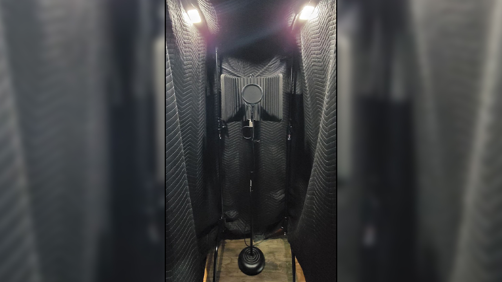
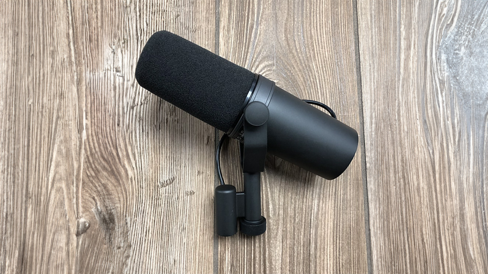
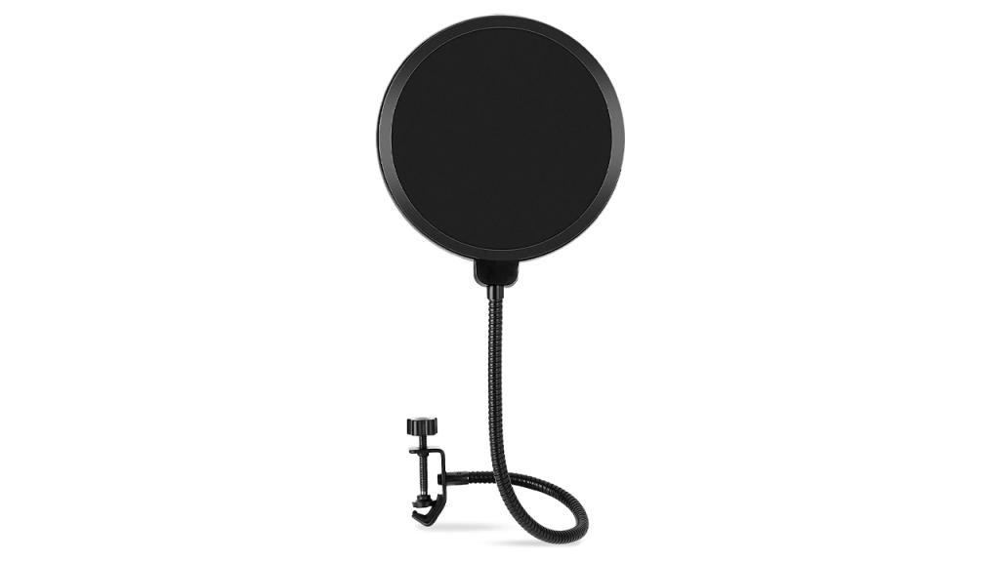
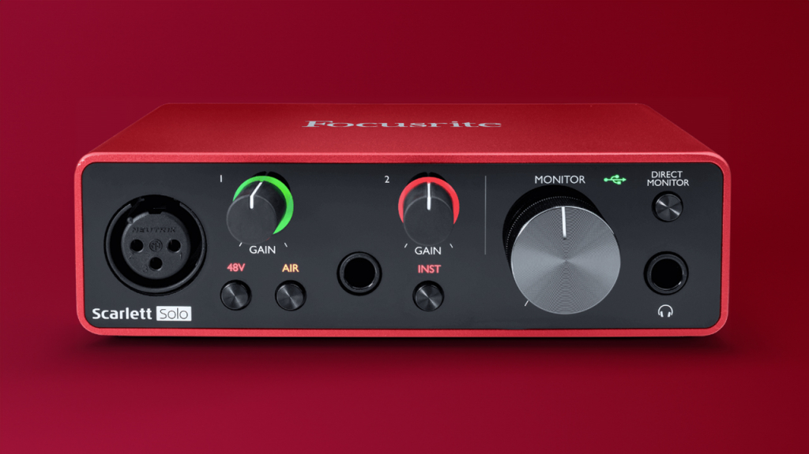
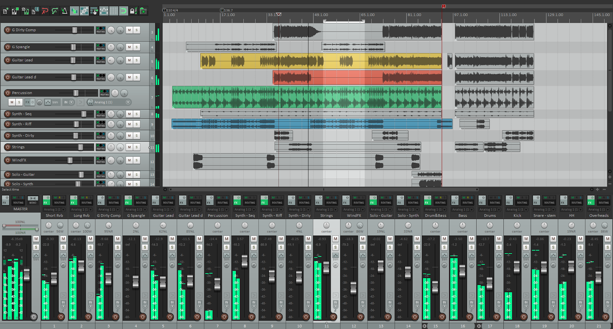

## An Introduction to Vocal Recording

Have you ever listened to your favorite singer, audiobook, or podcast and thought, _how do they do it_?

I spent over a decade as a musician — writing, recording, and performing music, before venturing into the world of commercial recording for films, video, and radio. From capturing live sound on set, to recording voiceovers, to custom scoring and intricate sound design, I’ve had countless opportunities to work with some of the best tools, and _even more_ opportunities to work with whatever I could get my hands on.

Modern recording technology has rapidly advanced since I got started and has become readily affordable and attainable. But when you start researching what to get and how to go about it, it can quickly become overwhelming. 

There’s countless ways to spend a lot of money building out a state of the art recording setup but if you’re just getting started, you can get away with a very simple and reasonably cost effective setup.

I’m going to share some simple methods and tools to help you get started recording serviceably commercial grade vocal recordings. 

### Vocal Recording 101:

*   Sound Treating the Recording Space
*   Vocal Recording Equipment & Accessories
*   Recording & Editing Software

Let’s get started!

## Sound Treating the Recording Space

Ever peered into the world of high-end recording studios? You know, the kind with bulletproof glass, floating floors, and walls so intricately layered you’d think they were lasagna? These studios are architectural marvels, engineered to deliver that pristine, pitch-perfect sound. 

_And they’re expensive as hell._

Good news though, we can still capture some excellent audio without those luxurious setups. 

First things first — aim for a “dead” space when it comes to recording. No, I’m not talking about a spooky, haunted room. In audio-speak, “dead” means a space devoid of sound reflection. 

Imagine a room swathed in materials that soak up sound like a sponge, rather than sending it ping-ponging around the room. We’re talking plush, thick surfaces as opposed to your typical drywall.

Skimp on this, and guess what? Your recording will echo like you’re belting out tunes in the shower. 

Now, what if you could mimic the audio finesse of a professional studio with just a handful of moving blankets and a well-placed closet? 

Well, you can! There’s still an art to it, but it’s nothing that’ll have you pulling your hair out. So as you venture into creating your personal audio haven, remember, you don’t need to break the bank to break into the industry. 

In the setup above, we’ve got a couple of [C-stands](https://geni.us/c-stands), three cushy moving blankets, and [a pair of magnetic lights](https://geni.us/magnet-lights). The lights are helpful if you’re reading a script or are scared of the dark.

Want to kick it up a notch? Throw in an extra blanket to seal off your makeshift doorway, and perhaps add a rug to dampen the floor vibrations. In all the times I’ve resorted to this MacGyver-esque setup, I’ve seldom found the need for that additional blanket or rug. But hey, when it comes to soundproofing, more is undeniably merrier.

The microphone is enveloped by absorbent, thick materials that drink in sound like your morning coffee absorbs your sleepiness. 

Sure, the floor may play the part of the lone reflective villain here, but with the combinations of blankets and an isolation shield, it’s hard for any sound to make the round-trip from floor to mic.

Of course, this isn’t a _one size fits all_ situation. The configuration might differ from person to person, but the core principle remains — you’re striving for a controlled, whisper-quiet space. The aim is to keep things as pure and clean as possible. 

## Vocal Recording Equipment & Accessories

Let’s review the basic recording equipment needed for voice recording:

*   Microphone
*   Microphone Stand
*   Pop Filter
*   Isolation Shield
*   XLR Cables
*   Recording Interface

### The Microphone

In my humble opinion, the best option for an easy to use, high quality, all-purpose microphone from whispering, to talking, to [screaming heavy metal](https://youtu.be/9wwEnJAztBA?t=471), has to be [the Shure SM7B](https://geni.us/shure-sm7b-vocal).

Ah, the iconic Shure SM7B! Yep, that’s the one — the microphone gracing the setups of podcasters, radio broadcasters, and even music pros. It’s your best all-around option for the money, no question. 

It’s forgiving too; you can touch it without picking up the minute sounds of your finger joints, and believe me, many microphones are _that_ sensitive.

It’s the go-to mic for vocal recording across the board, and I’m fully on board with that sentiment.

A brand new Shure SM7B is around $400. Yeah, it’s a bit of a hit if you’re just getting started. However, you can find used ones for about half the price. These microphones are durable and hold their value well, so going used isn’t a bad option, at least to test it out.

### Microphone Stand

You could hold the Shure SM7B in your hand but that’s not the most optimal way to go about it. Especially if you’re adding extras like an isolation shield or a pop filter — more on those goodies in a bit. 

Let’s minimize handling and focus on what truly matters: capturing the purest, top-notch performance. 

[So get yourself a mic stand](https://geni.us/mic-stand-vocal). These come in a whole array of styles — desktop, bendy, clip-on, even the hanging types that make you feel like a radio host. My go-to is usually the articulating BOOM stand, complete with that horizontal arm, perfect if you’ve got an instrument to wield. 

But for the task at hand, let’s stick to the basics: a straightforward, vertical mic stand will do the job. It’s the best option to easily accommodate any of the attachments that we’ll cover next. 

### Pop Filter

Pop filters are used to do exactly that, filter out the “pops”. More specifically, to dissipate the sudden rush of air created by speaking plosives. Some examples include P, B, and D sounds. This creates a perceived bassy “pop” sound.

Pop filters also come in all shapes and sizes and can range from $5 up to over $200. While the more expensive filters are arguably better, they’re not necessary for getting started and the difference is negligible to the untrained ear.

[Here’s a good one](https://geni.us/pop-filter-vocal) for just ten bucks.

At the very least, you could wrap a thin tee shirt over an upturned hanger or a tennis racket. I speak from experience here and I can say that it still gets the job done.

Some microphones like the SM7B come with pop filters that slide over the capsule. These can still let some “pop” through so I use both the slide over and an attached filter like the one mentioned above.

### Isolation Shield

An [isolation shield](https://geni.us/iso-shield) isn’t completely necessary if your recording space has been treated well enough. I’m including it for those working with a humble, minimalist setup in the corner of their office, basement, or closet. The more sound that can be controlled, the better.

It’s a bit self explanatory but the purpose of these isolation shields is to catch all the sound after it passes the microphone. 

Just like Mom, microphones actually do seem to have “eyes on the back of their head” (or in this case, ears… you get it) and they will pick up noise behind them.

You can find one anywhere from $20 to $200. There is also the option to get a little crafty and just make one. [Here’s an example](https://www.prosoundtraining.com/2015/07/31/diy-microphone-shield-gobo/) of a guy who threw one together with a 3-ring binder, 2-foam panels, and some glue.

### XLR Cables

99.9% of microphones (even some video and lighting equipment) use XLR cables. XLR = External Line Return. You can tell an XLR cable by their circular design with 3 to 7 pins in the connector.

You probably don’t want to get the absolute cheapest cable you can find but you don’t have to spend a fortune either. You can use virtually any 3-pin XLR cable for almost any microphone as long as it has a male and female end. 

XLR cables can cost anywhere from $3 and up. You DO run the risk of getting “line noise” with cheaper cables so keep an eye out for that. Do some research, read reviews, and look around before you buy. 

The cable is the conduit through which the audio signal flows. The last thing you want to do is invest a bunch of money into a recording setup only to have it hampered by a cheap cable.

With that being said, [here’s a decent option](https://geni.us/pearstone-xlr) to get started with.

### Recording Interface

Unfortunately computers don’t come with XLR inputs so an audio interface will be needed to connect your microphone to your computer. This will likely be your second largest purchase when building a vocal recording setup. 

Audio interfaces can be found for as low as $20 to $30 all the way up to thousands. A good place to look is in the $50 to $100 range. The reason being that the price reflects what kind of preamp is built into the interface. A preamp amplifies the analog audio signal before it gets digitized into your computer. 

A great audio interface is the [Focusrite Scarlett Solo](https://geni.us/focusrite-scarlett-so) for $100.

It has a 1-XLR input and a 1-¼” instrument cable input to give you some recording variety. Since we are talking specifically about vocals, this will do more than enough for single source recording.

## Let’s Talk Software

You’re gonna need a DAW aka a Digital Audio Workstation.

This is the software that’s the backbone of your recording and audio processing journey. The market is flooded with options: ProTools, Logic, Ableton, FL Studio, Cubase, just to name a few.

Now here’s the thing, they all pretty much have the same core functions. The differentiating factors? Extra features, your budget, and what feels right for you. 

Some DAWs lean into specific aspects of audio work beyond the standard capabilities. Take FL Studio for instance; it’s a powerhouse for beat building, loops, and electronic music production, all while offering the basic functionalities for recording and audio processing.

I, however, recommend [REAPER](https://www.reaper.fm/). 

It’s my DAW of choice for professional and personal use. And the best part, it’s free!

The only “payment” is a mere 5-second pause when you boot up the program. After that, you’re off to the races and ready to lay down some tracks. There’s an option to toss $60 their way to skip those 5 seconds, if you feel so inclined.

It’s not the prettiest interface right out the box but you can customize it to look however you want. You can also find premade custom layouts that look exactly like other DAWs.

You’re able to record directly into REAPER. It also has all the power and basic tools you need for post production (EQ, effects, mixing, mastering).

One stop shop, all in one, start to finish, for FREE!

There are other free options, like Audacity for example, but most don’t have the depth of capabilities that are packed into REAPER.

## Wrapping it Up

The basic fundamentals of recording the human voice are easy to learn and you don’t have to sink your whole bank account into remodeling your basement to do so.

I hope this article helps you get started recording vocals. If you’re really in a pinch, _you could_ just talk into your phone under your comforter, just saying.

Sooner than later, I’m going to run through the basics of setting all this stuff up and actually recording things in REAPER!

See ya there, thanks for reading, and have fun recording!
