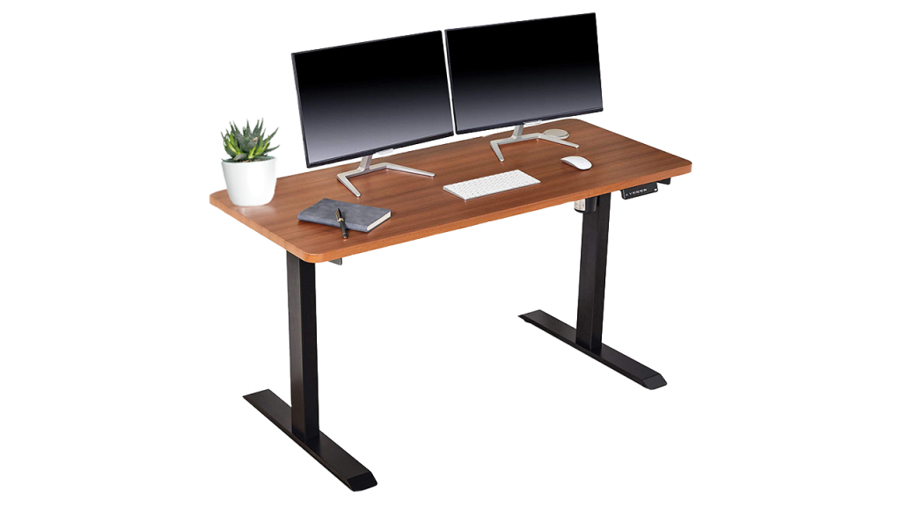
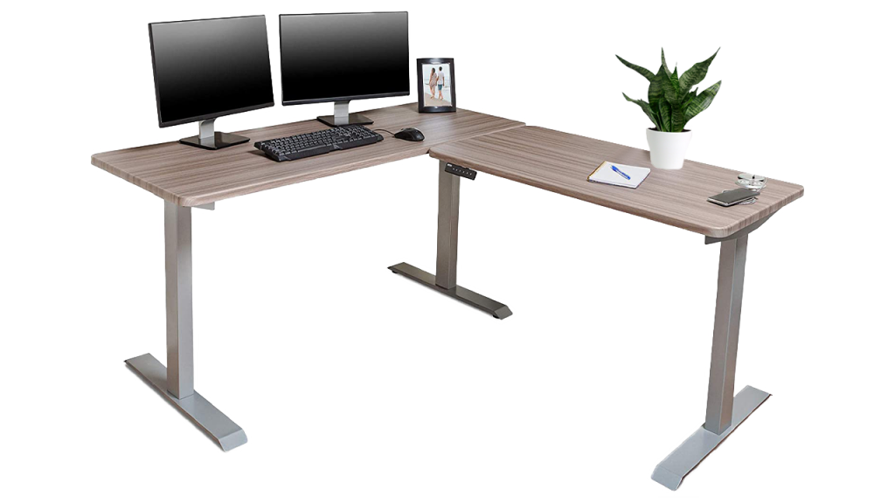
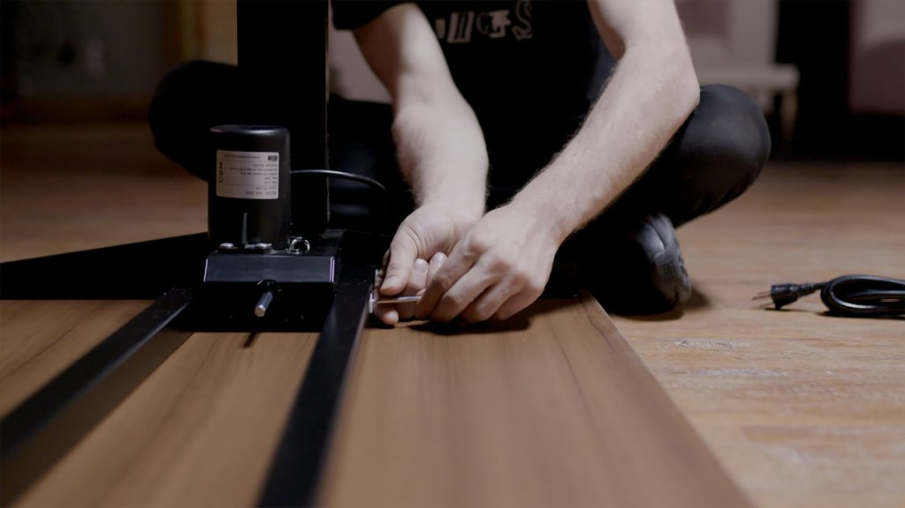
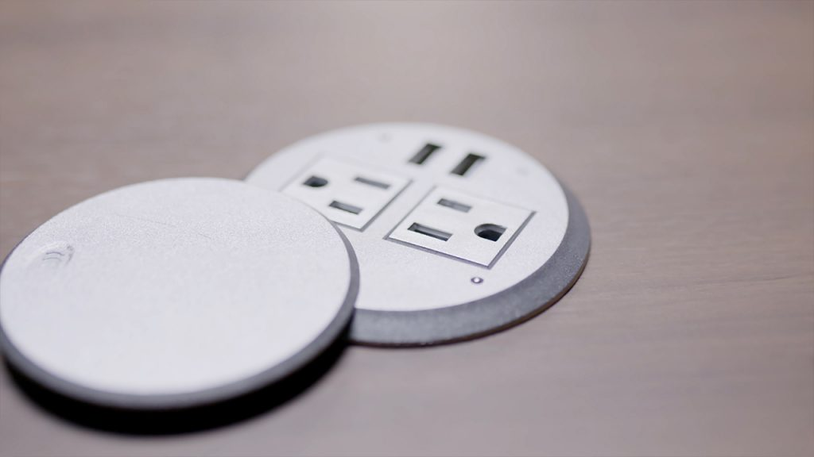
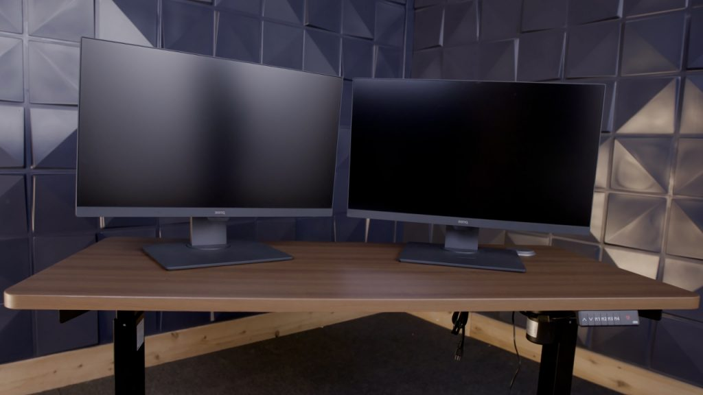
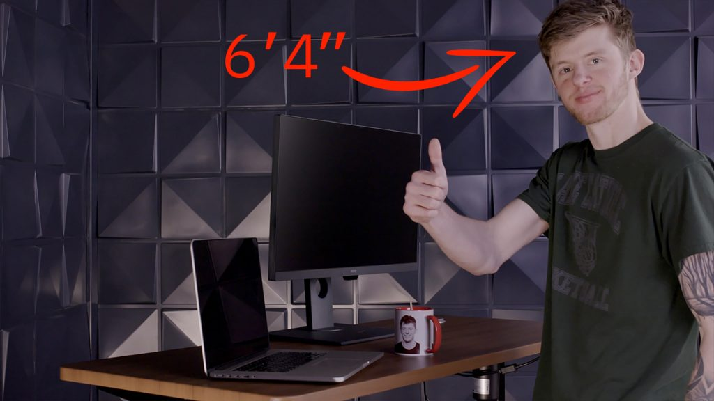
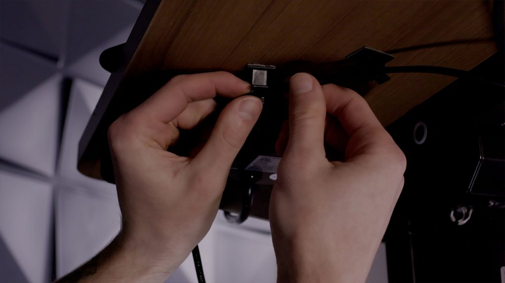
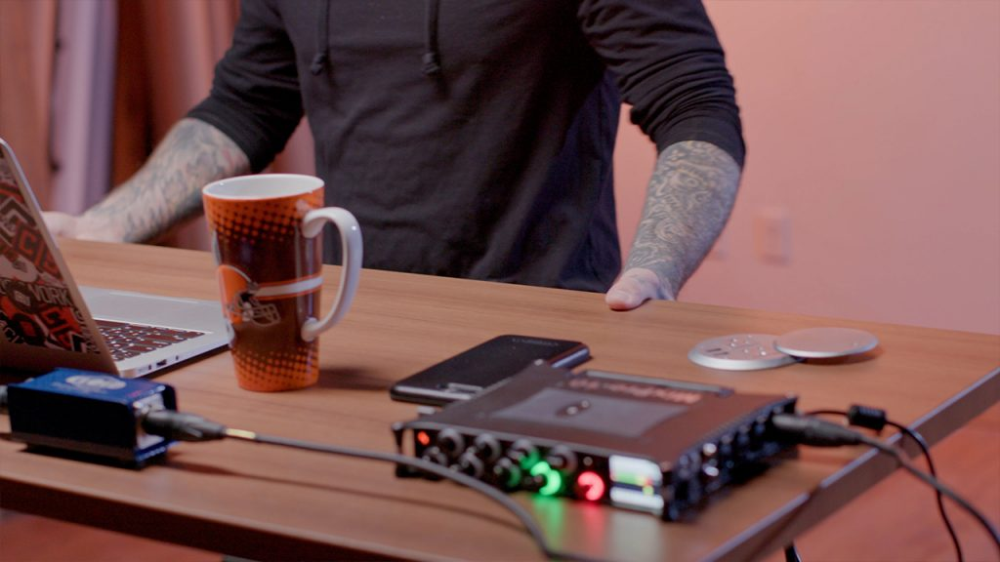
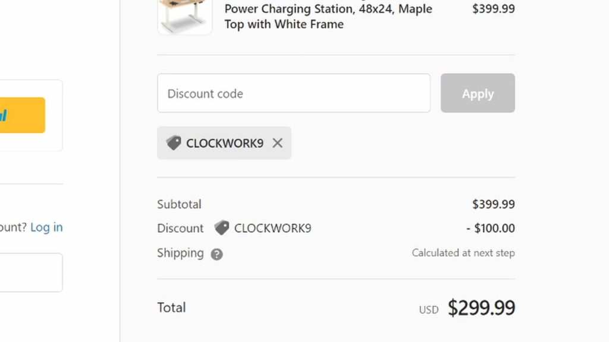

<iframe width="560" height="315" src="https://www.youtube.com/embed/8DR9LRMN5Zs" title="The Best Standing Desk on Amazon for under $500 in 2021? Review of the Brodan Electric Standing Desk" loading="lazy" frameborder="0" allow="accelerometer; autoplay; clipboard-write; encrypted-media; gyroscope; picture-in-picture; web-share" allowfullscreen=""></iframe>

We may not be electric standing desk experts, but we did [review an UpLift standing desk](https://clockwork9.com/2019/01/28/uplift-its-more-than-a-desk/) one time and it blew the fuck up.

Since then, several other standing desk companies have asked us to do a review on one of their desks. But we’ve turned ‘em all down. We’re not gonna do anything short of an honest review, and it’d be rude to accept a desk just to crap on it.

But then [Brodan](https://brodanusa.com/?ref=clockwork9) came along. We checked out their desks and thought they had a solid product and at a really good price point. So we agreed to review a couple of their desks but told them we were going to be 100% honest. They’re confident in their products, so they were all for it. And here we are.

## Here Come the Desks!

We picked out two desks. [One is a regular 54×24 desk with a Walnut top and black frame](https://geni.us/kLDx9CJ). This one comes out to around $300 on Amazon or after discounts on the Brodan website.

The other is a [67×59 inch L-desk with an oak top](https://geni.us/R6RhJ) and it goes for a little over $700. This bad boy will replace my current L-desk, a well overdue upgrade.

The boxes showed up in good shape. Branding on point. Feelin’ good about it.

The build process was very easy to follow. Packaging was neat and organized. The instructions are straightforward. If you’re an able-bodied person you could definitely build either of these by yourself. 

The regular desk took about 45 minutes and the L-desk took exactly an hour to build. No complaints there.

## Features & Quality

Honestly, I’m pretty impressed. 

I love the wooden finish and rounded edges. The legs are sleek and modern, along with the interface that allows you to adjust the height. In general just a good minimalist design. 

One of my favorite parts is the outlet port positioned on the top corner of the desk. This gives you two outlets and two usb ports always within reach whether you’re standing or sitting. 

If I’m being critical, I wish both desks had just a few more inches of depth to ‘em but honestly not a deal breaker. Especially considering the price. The standard desk is perfect for those with 1 monitor, but you could fit 2 pretty comfortably depending on their size. 

From a functionality standpoint, it’s nice that the motors are built into the legs. When it’s moving up or down, it’s pretty quiet and definitely a smooth ride. 

For all you tall people out there, Fitz is 6’4” and at standing height he’s comfortable behind the desk. I myself, as a man of humble height, find it to be comfortable sitting, standing and anywhere in between. 

With the L-Desk you get three presets which you can easily customize, so I set up my perfect sitting height, standing height, and with the third preset, I set it to the perfect height for Zoom Calls. The regular desk has four, but I think that’s just overkill, three is plenty.

The desks do have a fair amount of cables, which is to be expected. But they hook ya up with cable holders to get everything sorted out and organized underneath and it looks great.

## Let’s Get Critical

At standing height, you do get a bit of wobble, but nothing cumbersome or outrageous. Honestly not a lot to complain about with these. If I’m being picky, I don’t love where the desks meet each other on the L-Desk due to the rounded corners. The seam is fine, but it’d be nice if these were flush. Far from a deal breaker though, barely an inconvenience. 

My last gripe is I can’t put the desk flush to the wall due to the feet sticking out about an inch further than the desktop. Still not a deal breaker, as they provide good stability and having a desk that moves up and down flush against a wall isn’t advisable anyways.

## Comparing to the Competitors

So how do Brodan’s desks compare to some of the top sellers on Amazon? I went through the top listings when searching “standing desk” and found that Brodan kind of takes the cake.

[This one from Fezibo](https://geni.us/J8KAMo) is a little smaller and comes with a drawer which I don’t think I’d ever use. But the big drawback is that the desktop comes in two pieces. So you have a seam running through the middle of your desk. This is a dealbreaker for me, and actually pretty common with a lot of desks around this price point. It also doesn’t have the outlets on top and it’s only a little cheaper so I don’t think it’s worth it. 

[The Tranzendesk looks cool](https://geni.us/hDPxf). It’s bigger and has a second shelf. But it’s $400 and isn’t electric. Call my Mr. Fancy Pants, but I ain’t dropping $400 on a desk I gotta crank to adjust up and down.

[The Vari Electric Standing Desk](https://geni.us/L45PN) looks really nice and has a lot of surface options. It’s also deeper than the Brodan and has a solid top. But it’s more expensive and doesn’t have the desktop outlets. Not a bad option but I’m still giving Brodan the edge here.

[Last one I’ll mention is from SHW](https://geni.us/cPZd). It’s about the same size and has 4 height presets. But again, I only use 2. Like others, the table top comes in 2 pieces, so you gotta deal with the seam. And again, it doesn’t have the outlets on top. If it were significantly cheaper than the Brodan, I’d consider it. But they’re at a similar price so I’m gonna have to pass.

Looking at standing L-Desks and I came to similar conclusions. [This one from Vivo is solid](https://geni.us/aRBRm) but doesn’t have the outlets on the desktop and the main complaint in the comments is that it was a pain in the ass to build. Also looks like it only comes with a black top. For a similar price as the Brodan, I’m goin’ Brodan.

[I’ll admit this L-Desk from the S Stand Up Desk Store looks really nice](https://geni.us/snUZ9u) and might be a good option too. It’s actually similar to ours from Brodan in a lot of ways and it’s more flush where the two desks meet rather than having the rounded corner issue I mentioned earlier. However, there’s no outlets on top, it’s a bit more expensive and it doesn’t have a lot of reviews, so it’s a little tougher to gauge. But definitely worth considering. 

## Get the Deals

To wrap this up, we couldn’t be more pleased with our desks from Brodan and would definitely recommend them. They offer a 1 year warranty on the frame and any electrical parts, which is nice too. And in talking to them, they seem like genuine people.

Are there fancier standing desks out there? For sure. If you want to spend a good chunk of change, there’s a million options. But if you’re looking to keep things budget friendly, Brodan provides excellent value.

I showed mine to a friend and he immediately asked where he could get one. I told him to hold off till we had our promo code, which we have now. So with that being said: head over to [brodanusa.com](https://brodanusa.com/?ref=clockwork9) and use our **Coupon Code: clockwork9** to get $100 off your order.

Or if you want to grab it on Amazon like we did, [hit this link](https://geni.us/DTG9XtP). 

\*As an Amazon Associate we earn from qualifying purchases.

\*As a member of Brodan’s Partner Program we earn from qualifying purchases.
