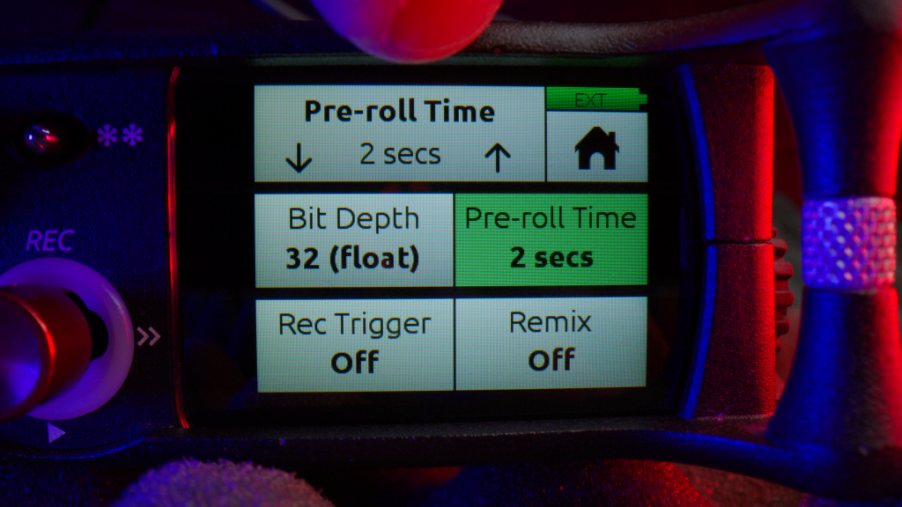
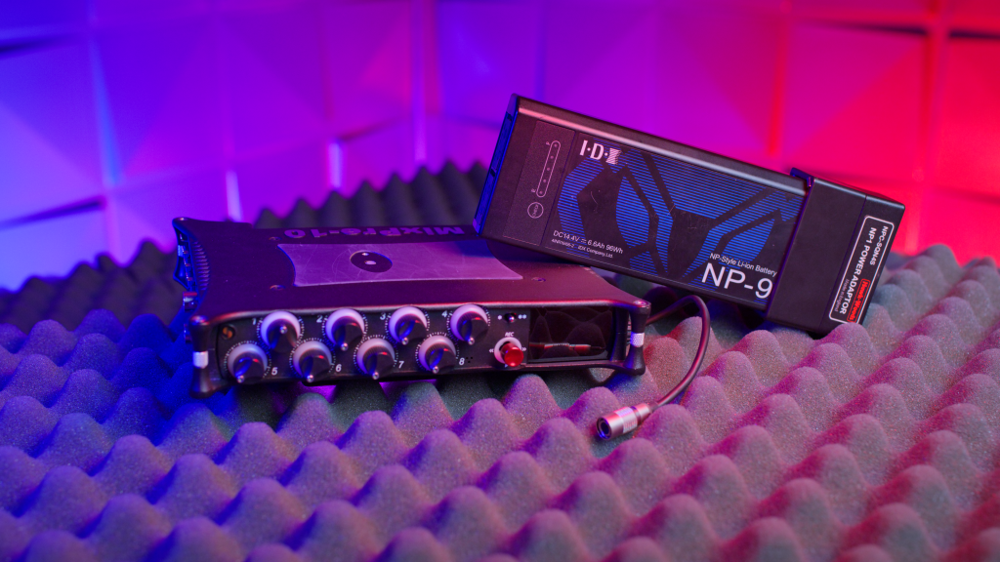
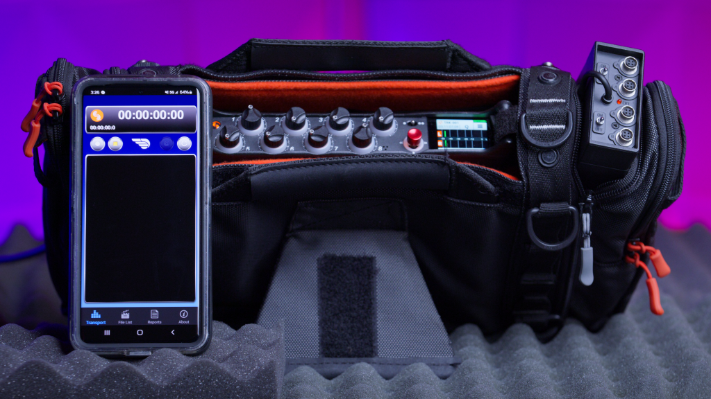
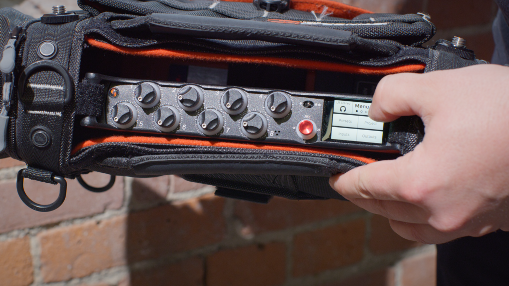
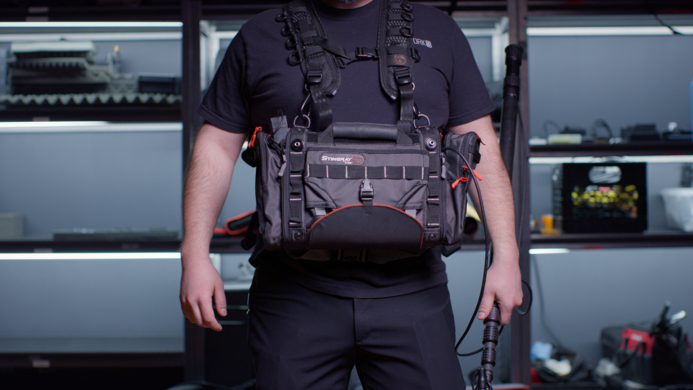

<iframe width="560" height="315" src="https://www.youtube.com/embed/IxEktr1pnpc" title="Is This THE Best Audio Recorder Of All Time?" loading="lazy" frameborder="0" allow="accelerometer; autoplay; clipboard-write; encrypted-media; gyroscope; picture-in-picture; web-share" allowfullscreen=""></iframe>

[They say sound and visuals are 50](https://clockwork9.com/blog/creative/why-you-need-to-sound-design-your-videos/)[\-50](https://clockwork9.com/blog/creative/why-you-need-to-sound-design-your-videos/). And they’re absolutely right. When it comes to carrying half of the experience, you don’t want to mess around with second-best. Enter the [Sound Devices MixPre-10 II](https://www.bhphotovideo.com/c/product/1503006-REG/sound_devices_mixpre_10_ii_10_channel.html/?ap=y&ap=y&smp=y&smp=y&store=420&lsft=BI%3A6879&gad_source=1&gad_campaignid=13531530366&gbraid=0AAAAAD7yMh07tEuDlATV74gZ50yTfmpyT&gclid=CjwKCAjwxfjGBhAUEiwAKWPwDivo0Zt9AYPvWMRMZr95_bNhkU_CBUNsPkSvxn2JFizSNj0vl2mfLhoCLJ8QAvD_BwE), the trusty sidekick for any pro in the field (or amateur who just wants to feel pro). After 4 years of using this magnificent piece of gear, I can tell you, it’s like the Swiss Army knife of audio recorders, minus the bottle opener (which would be pretty cool).

## **Recording: High Quality Safety Net**

The **MixPre-10 II** offers 10 total analog inputs. (Get it? Mix Pre-“**10**”?) Consisting of 8 mic-line inputs and 2 Auxiliary inputs. It can also handle **32-bit float recording** and **192 kHz sample rates**—in other words, your audio can be a bit too loud, quiet, or anywhere in between, and it’ll still sound beautiful. Plus, it has **10 seconds of pre-roll at 48 kHz** so you’ll never miss the beginning of a take, even if your timing is worse than a new drummer with no metronome.  
  
I’m only mildly ashamed to admit that both of these features have saved my butt a couple times.

## **Storage: No More Failed File Fears**

Ever get back after a long day on set, dump your cards and find that your best take got corrupted or lost? With the **MixPre-10 II**, not only do you get **SD card recording**, but it’s capable and smart enough to auto-copy backups to a separate **USB drive**. You’ll feel like the most organized version of yourself (even if your desktop is still littered with a hundred icons).

The **MixPre-10 II** gives you full control over **ISO recording, gain, pan, low-cut**, and even **phase inversion** so it doesn’t feel like your ears are cross-eyed.

## **Power: More Pow-****ALL** **The Power**

The **MixPre-10 II** is like the Bear Grylls of recorders. It’ll live on pretty much anything. You can power it with **AC**, **AA batteries**, **Sony L-Mount batteries**, **NP style batteries** or really anything through a **hirose** port**.**

I personally recommend NP-type batteries with an NP to Hirose adaptor. You will need a nap before the Mix Pre does. It also outputs **phantom power** making the Mix Pre puff its chest and say “come at me” to all those fancy condenser mics.

## **Headphone Amp: Your Ears Feel The Love**

The **high-fidelity headphone amplifier** on the Mix Pre-10 II isn’t just there to make your headphones louder—it’s designed with **ultra-low distortion and wide dynamic range**, which means you’re hearing your audio exactly as it’s meant to be heard. You’ll catch every detail, whether it’s the softest whisper or the loudest boom. It’s good. I catch myself adjusting levels to pick up on different things every time we roll. “Yes, I can still hear them in the other room.”

## **Connectivity: Like Networking But Better**

If you need to connect your rig, the **MixPre-10 II** plays nice with **USB control surfaces**, lets you **stream audio via USB**, and even lets you take the reins with **Bluetooth control**. Just download the **Sound Devices Wingman** app and stay out of the way while keeping your controls with you. Fewer cables to trip over.

## **Customization: Let’s Get Fancy**

Whether you’re feeling basic, advanced, or custom—there’s a mode for that. You can also use plugins to tweak your setup to be as simple or complex as your audio dreams demand. Those aren’t free but when you are looking at an option for real time noise assist, the wallet starts warming up. You know what I mean. Luckily, being one who does all the work in post, has its advantages here. 

“Not today Wallet, not today”.

## **Timecode: Timing Is Everything**

It has a built-in timecode generator which makes it super easy to sync with other devices. You can trigger recording via timecode or HDMI. Even your DP will be impressed—and they don’t impress easily. It’s not a bad feeling being the Master of Timecode either.

## **Screen: No More Squinting In The Sun**

Working outside? Recreating the “lots of guns” scene in the matrix in a bright white room? Well good news everyone! The full color touch screen is sunlight-readable, which means you’ll never have to do that awkward ‘courtesy flag’ move again. The LED metering makes it easy to keep an eye on your levels as well. Whether it’s sunny, shady, or just too bright for comfort, you will still be able to see what you are doing.

## **Size: Overhead Compartment Ready**

Let’s face it: we don’t need more stuff weighing us down (on set OR in life). The **MixPre-10 II** is tiny,  lightweight and rugged. All thanks to its aluminum chassis, built to take a beating (of course, please don’t test this with a hammer or throw it out of your car). Whether you’re out in the middle of a strawberry field or lying down, crammed behind the back seats of an SUV (yes, I really had to do that once), this little guy can fit and handle the rough-n-tumble.

## **Nothing’s Perfect**

There are always things that mix a little bad in with the good. (Such as life) One of those things for this recorder is that on long running jobs, the recorder can start to get pretty hot with surface temps reaching upwards of 100°F. I can recall a few occasions where I’ll take my sound bag off and discover a Mix Pre-10 II sized sweat spot on my belly. That’s really fun to explain.

Another thing is that its small size comes with some complications. The touch screen can be hard to navigate if you have fat fingers, gloves, or a lack of accuracy. The aforementioned USB port is also located right next to the BNC ports for timecode, so if you have a backup USB drive installed, it makes it extremely difficult to grip and twist the BNC connector without tiny hands. 

The last thing can subjectively be a con but it’s all relative. **Price**. A brand new Sound Devices MixPre-10 II costs just under $2000. Then you have accessories, batteries, sd cards, plugins, etc. that are not always included. That noise assist plug-in starts at $300.  
  
Definitely do your research and see what other people are saying so you can be sure of what your money is buying. 

## **Ok, Wrap It Up**

This may have gotten a little long winded but that’s because there is so much to this little recorder. I cannot recommend this enough for any location sound recording. It can even dabble in foley because it can allow the user to go pretty much wherever to record whatever.

Thanks for reading!
