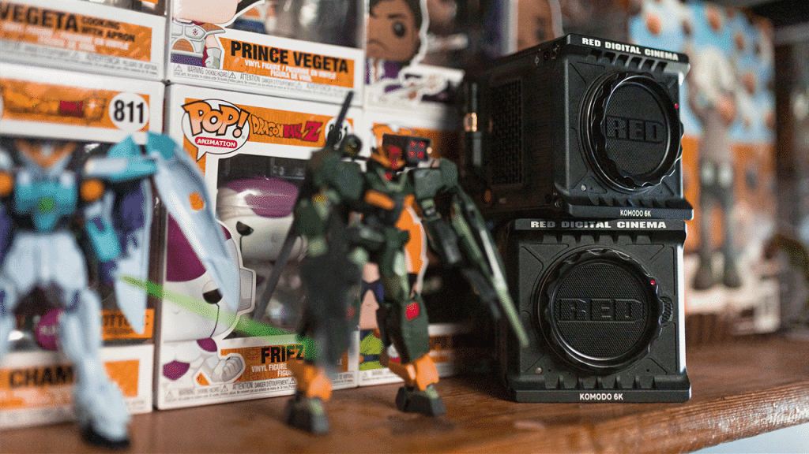

<iframe width="560" height="315" src="https://www.youtube.com/embed/FuZBimyaV4E" title="Our Review of the 6K RED Komodo" loading="lazy" frameborder="0" allow="accelerometer; autoplay; clipboard-write; encrypted-media; gyroscope; picture-in-picture; web-share" allowfullscreen=""></iframe>

## A RED Camera for $6,000.00 USD… What’s the Catch? 

[RED Digital Cinema](https://www.red.com) is one of the most widely recognized names in the camera and filmmaking industry but their questionable past made a lot of creators, including myself, skeptical as to what their intentions were with the [Komodo](https://www.red.com/komodo).

Creating a cinema camera that can fit into the palm of your hand seems too good to be true. Are they just slapping RED on off-brand parts and marking them up to maximize profit? You know, like the [Raven](https://www.red.com/news/red-further-simplifies-line-up-with-dragon-x-5k) and [Mysterium](https://support.red.com/hc/en-us/articles/115015468268-Discontinued-MYSTERIUM-and-MYSTERIUM-X-Repairs). 

We have a [Helium DSMC2 brain](https://www.red.com/DSMC2-BRAIN?quantity=1&sensor=2) that we use for most higher-end productions. We often paired that with our [Canon C200’s](https://www.usa.canon.com/internet/portal/us/home/products/details/cameras/cinema-eos/eos-c200). But when working with multiple codecs and color sciences, it can get pretty tough to get multiple angles to match each other stylistically. Switching between [Canon RAW](https://www.leadtools.com/help/sdk/v21/dh/to/file-formats-canon-raw-format-crw.html) and [Redcode](https://www.red.com/power-of-red-redcode) isn’t ideal so we had a decision to make: Do we go with another DSMC2 body or grab a couple Komodos? 

Spoiler alert: We grabbed the Komodos.

## Wow, it’s Tiny!

My initial reaction when I held this camera for the first time is how truly small it is. It actually feels lighter than my [Sony Alpha 7S III](https://geni.us/a7siii-sony). Adding a cage, lens, and [TB-50 adapter](https://www.ignitedigi.com.au/products/tb50-battery-adapters-for-movi-pro) will make the setup a bit more bulky but it’s still not nearly as colossal as our fully kitted out Helium. The Komodo’s small stature makes it extremely ideal for run-and-gun productions. 

## Autofocus is Solid

The autofocus is technically in beta along with half of its features but it still performs well. Does it hunt sometimes? Yes. Are the lowlight capabilities as powerful as a Sony mirrorless camera? No. But if you mount this thing on a [Mōvi Pro](https://freeflysystems.com/movi-pro), you’ve got a powerhouse rig for event coverage and productions that don’t require 8K delivery. 

## What Does a Video Editor and a Farmer Have in Common?

They both make good crops.

We tend to use 6K 16:9 and 4K 16:9 for slo-mo. The only downfall of 4K is that there is a crop, a 1.5x crop to be exact, and that is one of my main gripes about this camera. 

If you want to shoot at higher frame rates, you must lower the resolution and deal with that crop. 2K at 120 frames still looks pretty good but the noise and chromatic aberration become more apparent due to the massive crop factors. Just be prepared to plan accordingly when shooting at higher frame rates. 

## There’s an App for that!

The tiny touchscreen and buttons are a pain to use, especially when you’re strapped to a [Mōvi Pro](https://freeflysystems.com/movi-pro) with a [Ready Rig](https://www.ready-rig.com). The button on the side of the camera body can be tough to get to and it’s kind of awkward pressing record on the touchscreen. To combat this, we tend to use the smartphone app which is surprisingly well built. 

The menus themselves are pretty basic. Anyone who has previously worked with a RED camera should be able to navigate them without issue. 

## Ah, Shit — We Broke it

It’s worth noting that we had to send a Komodo back after a few months. We noticed random color shifting in the image and a super weird green tint effect that happened on camera bootup. RED told us they had never seen this issue before. 

We sent it back and they had it fixed within a couple of weeks and since it was under warranty, it didn’t cost us a dime. They evaluated the issue and determined it was a faulty board, and now the issue is gone. Yay!

## Dynamic Range

The Komodo delivers when it comes to dynamic range. We found that like with most cinema cameras that shoot in RAW format, the footage is very flexible in post. Bringing up shadows or bringing down highlights doesn’t mess with the image quality much. 

One of my favorite things about this camera is the inclusion of global shutter without sacrificing dynamic range or sharpness. Skin tones look natural. There is a slight green tint that most RED cameras tend to have but simply slapping one of RED’s own conversion LUTs on makes the image look super clean. A lot of reviews are raving about dynamic range but the highlight roll off is really what impresses me the most. 

## The Komodo Ain’t Perfect

It wouldn’t be an honest review without pointing out some flaws this camera has. We already mentioned the crop factor when shooting slo-mo but there are a few minor pitfalls I’d like to touch on. 

This camera requires more than just a lens and batteries to be fully functional. It’s damn near impossible to use without some kind of handle or gimbal. You’ll need a third-party monitor to see what you’re shooting because the screen is on top of the body and very small. 

It doesn’t have any XLR ports, only one 1/8 inch headphone jack and one microphone jack, both stereo.

These are issues that you will run into with a small, square form factor.

## Final Thoughts

As a filmmaker, the Komodo was a fun challenge. I learned a lot along the way. For example, adapting my shooting style when it comes to exposure and composition of R3Ds. 

It’s been a breath of fresh air following a whole new workflow that makes me stop and think more about the shots I’m getting. I have become much more intentional while using this camera, and that’s not just on shoots using the Komodo but on every shoot. Getting to know these little powerhouses made me want to optimize their power. It got me out of a creative funk which motivated me to shoot more. 

The picture quality straight out of the camera is enough to impress me. When you pair that with its wireless communication features, its compact size, the ability to adapt multiple lenses, and the assortment of formats and sizes that you can shoot in… this camera is one of the best I’ve ever used.
