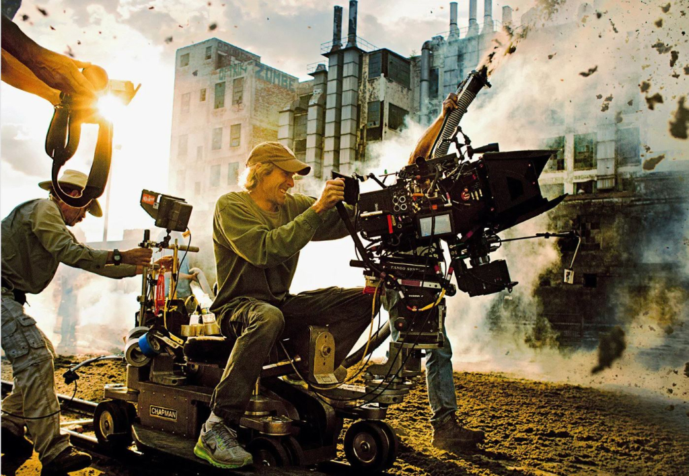
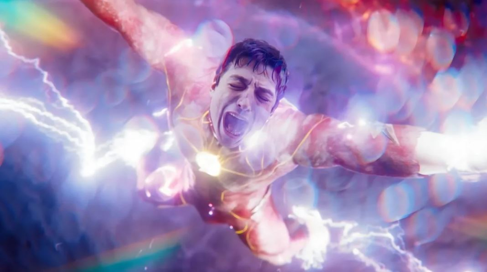
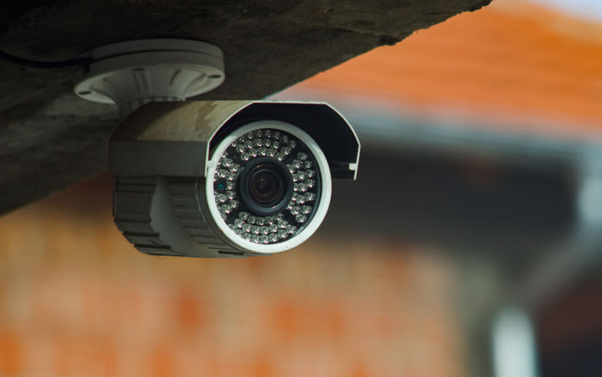

While the dawn of the new millennium brought forth a [digital revolution that rocked the film industry](https://www.wired.com/insights/2015/01/how-tech-shaped-film-making/) to its core, the rise of digital cameras revolutionized the art of capturing images. 

These marvels of technology replaced film reels with image sensors that transformed light into digital data.

The era of pixels had arrived, opening up a realm of infinite possibilities which aren’t limited to just long-form storytelling media, and while technology itself may have taken massive leaps, rapid advancements in visual effects, and digital tools, there has been a temptation to prioritize technical prowess over narrative substance. 

## A Tale of Two Worlds

I took my youngest brother to go see the [new Flash movie](https://www.imdb.com/title/tt0439572/) the other night for his birthday and couldn’t help but be shocked at the standards these giant epic movies have nowadays compared to even a decade ago. 

While being a fun, turn-your-brain-off experience, the movie was a cluster of fan service and bad CGI coupled with some decent acting and fun action-sequences. This seems to be enough for today’s audience who value instant gratification over intricate storytelling techniques. I myself am a victim of this at times, it’s a vice of mine, a guilty pleasure of sorts. 

In stark contrast, I finished [The Sopranos](https://www.imdb.com/title/tt0141842/?ref_=nv_sr_srsg_0_tt_8_nm_0_q_the%2520sopranos) for the second time last night. I couldn’t help but realize the show is truly a timeless classic that will likely never be replicated again from a filmmaking and storytelling standpoint. 

The cast grows in number with each episode but they somehow found a way to move the story forward, even if a character only appeared in a scene or two their story advanced.

Now, I’m only 26 years old and I know there were many pieces of visual media that were created “before my time” (Trust me, I’ve seen both [Godfather films](https://www.imdb.com/title/tt0068646/?ref_=fn_al_tt_1) and [Schindler’s List](https://www.imdb.com/title/tt0108052/?ref_=nv_sr_srsg_0_tt_8_nm_0_q_schindlers)) but how could this blueprint be so perfectly laid out 20 years ago in the form of a TV show while the industry seems to be advancing backwards in terms of originality and narrative impact?

I think I have a strong hypothesis to support this.

## One Step Forward, Two Steps Back

As technology progressed, the urge to reinvent the wheel and inspire through the visual medium regressed. Nowadays, you can hide crappy writing behind a wall of groundbreaking CGI and stunts. 

With the proliferation of streaming platforms and digital content, there is an overwhelming amount of material available to audiences. The sheer volume of content makes it challenging for individual films and shows to stand out. In an attempt to capture attention, some productions may prioritize sensationalism or visual spectacle over nuanced storytelling, resulting in a perceived regression in narrative depth.

Ultimately, the perceived relapse in narrative and visual storytelling should be seen as a complex interplay of various factors, rather than a definitive decline.

Filmmakers and storytellers continue to push the boundaries of creativity, and as audiences, we can actively seek out and support the gems that demonstrate the enduring power of storytelling in the evolving landscape of film and television, but outside of Hollywood have the advances in camera technology helped transform the world and our everyday life? The answer is YES.

## All This From a Slice of Gabagool?

Going back to The Sopranos (because I just can’t help myself), every time they would “whack” somebody or discuss their illegal dealings in public, I couldn’t help but think how none of these characters would exist in today’s world. 

I come from a midwest city, where the Italian mob once roamed freely and openly, but why were they so successful? The primary reason was that there were no phones, no security cameras, and no social media. 

If they beat the tar out of someone in public they could essentially get away without worrying about a bystander recording them or a security camera tagging their license plate as they drove away. There’s multiple scenes in The Sopranos that involve someone getting killed in broad daylight.

They wouldn’t have that luxury in today’s age and it’s why the mob has essentially drifted into oblivion since the turn of the 21st century. They ultimately have cameras to thank, er…. blame. 

Through the lens, these elusive figures became larger than life, their exploits splashed across the big screen, captivating audiences with tales of ambition, betrayal, and redemption.

It is in this realm that the camera romanticized their reality into fiction, its craft capturing the essence of criminal personas, allowing audiences to walk in the shoes of charismatic outlaws or witness the shattering consequences of their actions all while helping track them down in the real world, a wildly ironic situation. 

## They Are All Around You

Beyond the realm of Hollywood, the transformative power of camera technology has left an indelible mark on our society. The seeming omnipresence of cameras has reshaped our everyday experiences, providing a layer of accountability in our everyday actions as a whole. 

In this ever-evolving technological landscape, cameras have become the silent sentinels, changing the dynamics of power and transforming our world, one frame at a time.

As for Hollywood itself, well, attention spans aren’t getting any longer and media isn’t getting any harder to create. There are still timeless pieces of visual art still being made but you have to find the needle in the haystack full of imitation, inconsistency, and greed.

Consume what you want to consume, but remember that it affects not only your cognitive abilities but also your behavior and decision-making. Choose _wisely_ and tread _carefully_.
