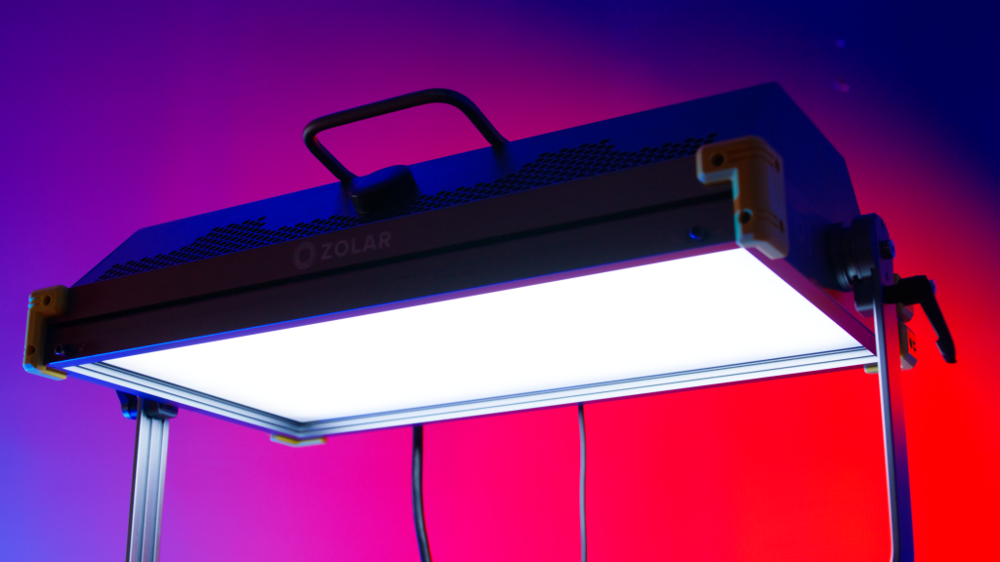
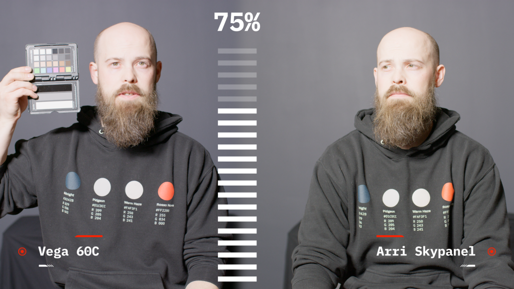
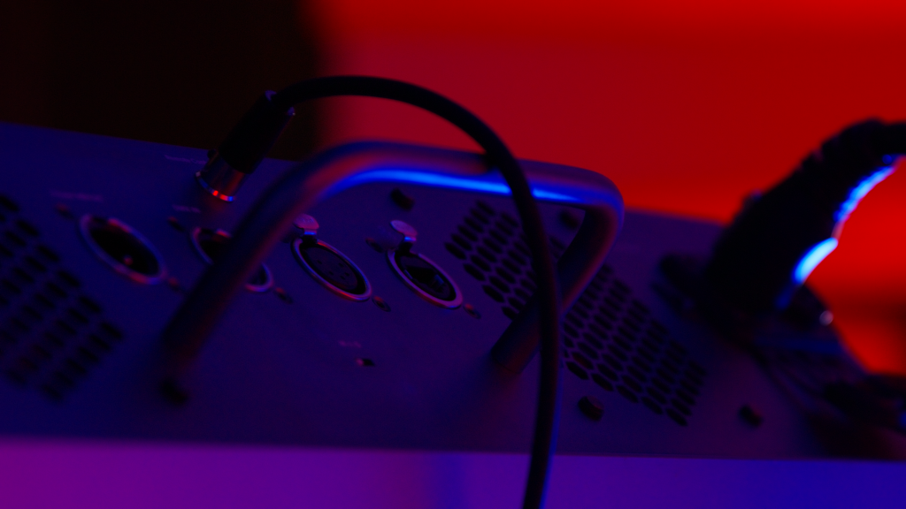
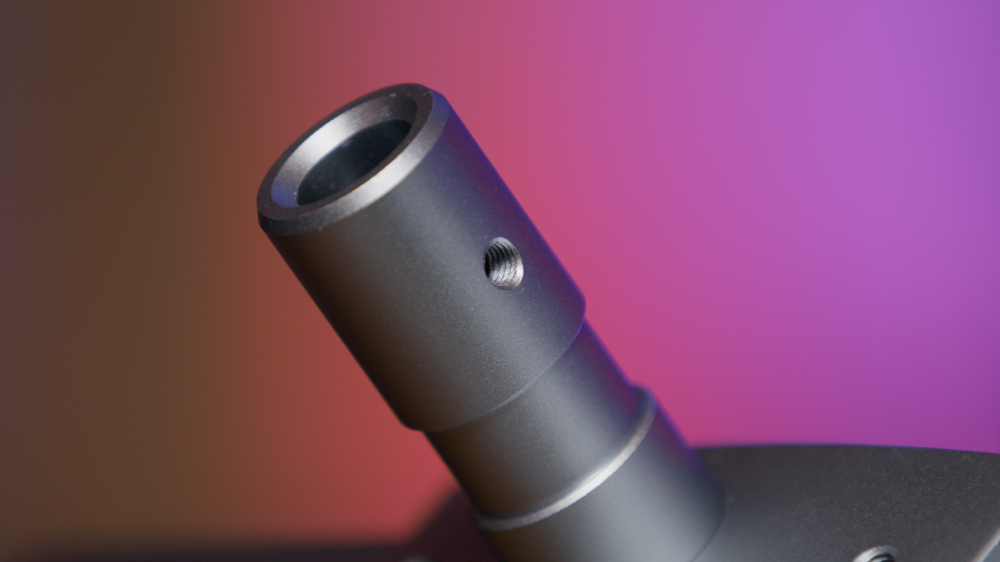
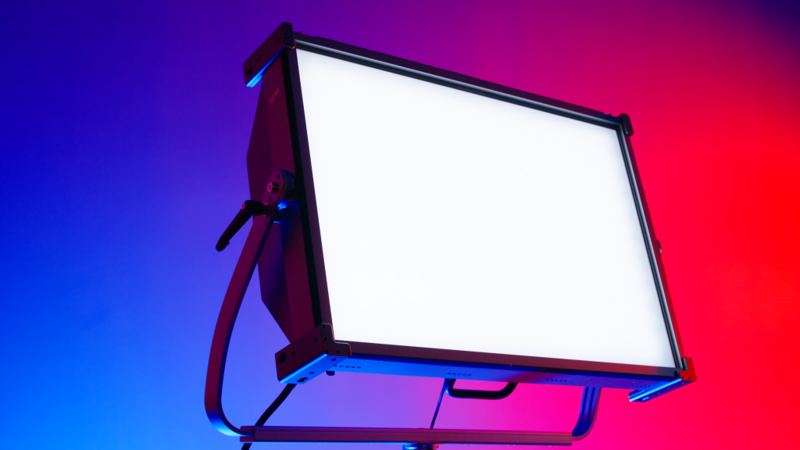
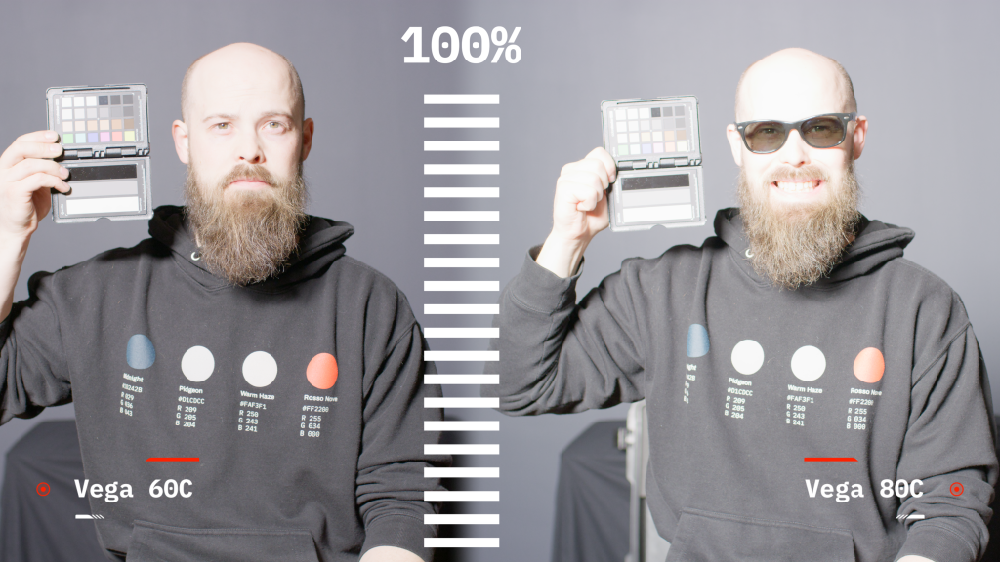
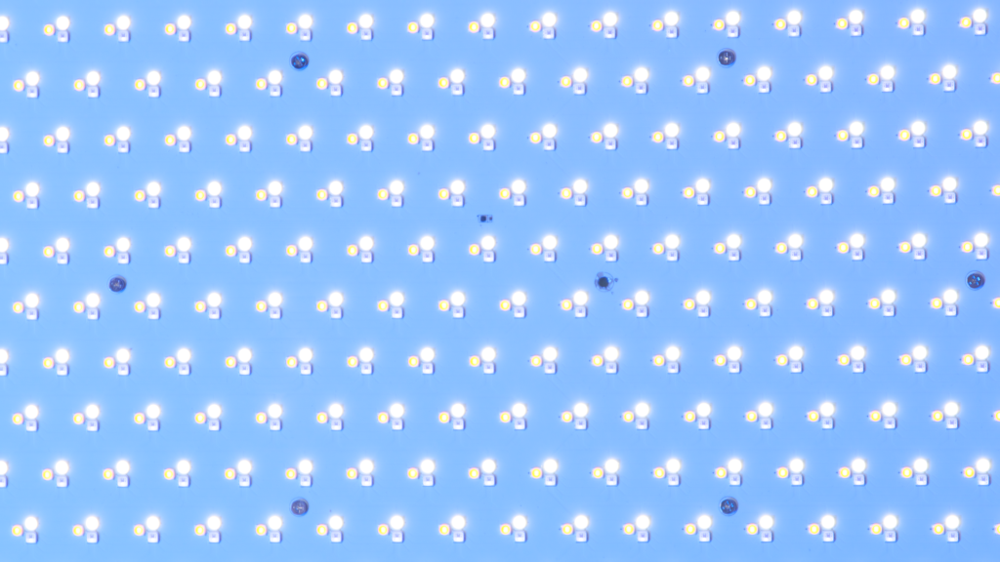

<iframe width="560" height="315" src="https://www.youtube.com/embed/5XVyqjpHtso" title="The Arri Killer Lineup?: Zolar Vega 60C AND 80C Light Review" loading="lazy" frameborder="0" allow="accelerometer; autoplay; clipboard-write; encrypted-media; gyroscope; picture-in-picture; web-share" allowfullscreen=""></iframe>

Welcome to an exclusive review of the upcoming lighting lineup for [Zolar](http://www.z-cam.com/zolar/). These lights are still warm from the [NAB showroom floor](https://nabshow.com/2023/)!

This line includes the specced out Vega 80C to the smaller and unreleased Vega 60C, and the beginner-level 1×1 panel Toliman 30S, [which we previously reviewed](https://clockwork9.com/blog/product-reviews/the-most-affordable-panel-light-for-video-production/).

I’m really excited to talk about these lights because they are truly impressive. I believe we have a new contender that is going to change the lighting market similar to what [Aputure](https://www.aputure.com/) did a decade ago. 

# The Vega 60C, a Perfect Medium

The Vega 60C is a full color Panel light in the same size and Lux categories as a [Arri S60-C SkyPanel](https://www.arri.com/en/lighting/led/skypanel/s60-c). These Arri Skypanels are our gold standard in our studio and most commercial shoots in general. Whether you’re in a professional soundstage or on a commercial shoot, Arri SkyPanels are probably on set and more often than not, they are the S60 variant. 

With such a powerful, sturdy, and reliable light from the producer of the highest grade cinema equipment in the world and the prospect of a replacement that is $1,500, I wanted to see how it stacks up and if it’s worth even considering as a viable competitor. 

The Zolar 60C holds the same [CRI and SSI scores](https://www.oscars.org/science-technology/projects/spectral-similarity-index-ssi), 98 and 90, as the Toliman 30 light I previously reviewed.

I’ll also plug [Newsshooters deep dive](https://www.newsshooter.com/2022/09/08/z-cam-zolar-1x1-led-panel-lights-review/) of the color data comparison as well, this is an in-depth analysis of each light in Zolars lineup.

Before we dive into specifics with the Vega 60C, I want to give you a quick explanation about the Spectrum Similarity Index or SSI. In Zolars official ratings, they are compared to a perfect light source AKA the sun. Some companies will compare an SSI to another light such as the Arri S60-C. So if you see a score higher than a 90, chances are it’s compared to another light unless explicitly told.

What Zolar did that makes their lights so accurate to the cameras sensor is use that very tech they have access to in the [parent Z Cam](http://www.z-cam.com/). Zolar took the codec and sensors from Z Cam to tune every LED in their panel lights. The results are both exemplary and data driven. 

## That’s All Cool, But How Does the Vega 60C Perform?

When comparing lights, performance is obviously the top metric, and compared to the Arri’s light performance, Zolar hits every mark.

My meter test shows that the Vega 60C edges out the S60-C SkyPanel at 100% and the color difference is obvious. Now our sky panels are a little older, this particular light has been out for about 6 years now and naturally lights will drift temperatures after a few thousand hours as stated by Arri and Zolar (3,000 hrs is the last stress test Zolar did before they noticed a color shift). 

So the difference in temperature based on what the panel is telling us is natural and it’s okay to be a bit off in most situations, but when matching a source like daylight from a window or other lights in the room, the Zolar outperforms Arri’s entire lineup, at least according to our controlled [Sekonic light meter](https://sekonic.com/products/) readings. 

These LEDs in most production light panels are rated to last 25,000 hours. That’s almost three years worth of being switched on and at full power too. So it’s safe to say used or new, LED panel lights will probably outlast your use for them. 

## Vega 60C Build Quality

With it’s all-aluminum frame and internal ballast design, the Vega 60C is lighter than the Arri S60-C and has no ballast as well. In addition, it’s weather resistant, so getting caught in the rain or at the wrong-end of a water mishap won’t set you back or need to be sent in for service _(theoretically)._

I’d like to note that the 60C exterior is also not final yet, think of this as a beta version of its build, but as you see it’s very similar at first glance to the Arri S60-C. I expect a single yoke tightening lever like all the other panel lights here and tie-downs to be included in the final version.

A quick note about the fans: they’re so silent when set to auto, we found you need at least an hour of use to hear the fans kick up or on at all.

The combo junior, baby pin adapter is very similar to our [Aputure Nova P300c](https://www.aputure.com/products/nova-p300c/). It’s very useful to be able to utilize whatever stand or mount you have available. I have actually stripped the threads of the baby pin adapter in an Aputure light and noticed a much beefier and higher grade aluminum(steel?) in the Zolar lights. 

So to sum all of this up, this light is truly **lighter**! Lighter in weight, higher intensity and better color accuracy. No ballast, rugged professional design and functionality. And at $1,500, it’s a no-brainer in my humble opinion! 

## It’s Not Perfect, Yet

Now the only caveat, like the 30 series lights, they will come in a case only meant for shipping from the factory. I highly recommend buying a hard case for any film gear and especially production lights like this; it’s just the safest and best way to transport your gear.

Zolar has mentioned that they are looking for a hard case supplier and will have options to add a hard case to your light order in the future. The foam they come in does seem like it would be useful and hold up inside a hard case. I think their plan is to make the foam that would drop into a standard size hard case from [Pelican](https://www.pelican.com/us/en/shop/products/cases?gclid=CjwKCAjw2K6lBhBXEiwA5RjtCQUbV_mtdy5ea5ypfuA65r6JnZyCd4Gi1nmJbaT4dh7mPoPpNv7nzxoCiIQQAvD_BwE&gclsrc=aw.ds), [S](https://www.skbcases.com/)[K](https://www.skbcases.com/)[B](https://www.skbcases.com/) and other suppliers. 

The additional accessories for a panel light like softbox, barn doors, different degree grids as well as the diffusion inserts or as Zolar calls them “stylists” are all available separately. They are much easier to install than our SkyPanel’s dreaded chimera, at least.

Again, way more affordable than other manufacturers lighting accessories that are pretty much like buying a second light.

My thoughts on the Vega 60C are simple and clear: _buy this light_.

If you’re a professional looking for the best lighting, not just in comparison to the sun itself, but tuned to be the best for a camera’s CMOS sensor, then the Zolar lighting lineup is for you. This light will be a powerful key on any set and give you precise and reliable lighting for most spaces.

## The Vega 80C, a True Beast

Now if you’re a serious lighting professional, gaffer, studio, medium to large production company or rental house looking to stock the latest and greatest lighting… I give you the Zolar Vega 80C. 

This huge 2000 Watt output LED panel is stepping into the ring like a 280 pound heavyweight. Once you need 2-3 people to safely mount a light, it’s officially a monster light in my book. This big boy offers all the features the 60C offers with some additional build design features that make this a true competitor to the [Arri S360-C SkyPanel](https://www.arri.com/en/lighting/led/skypanel/s360-c).

The Arri S360-C is a monstrous 62″ x 48″ 90 pound panel with a 1600 watt power consumption rating, that’s about 4 times as bright as an Arri S60-C. And you guessed it, about 4 times the price of a S-60C, sitting at a happy $20,000 or about $30,000 kitted out with everything you need from Arri.

In comparison, the Vega 80C is… well the official stats are not out yet and we lack the means to weigh an object of its caliber. I _can_ confirm though, the fixture will have these solid aluminum tie-off/down corners and that the light power rating and internals are going to be the same as shown and tested here today. 

I don’t have an S360-C or access to one at this time to compare today. But at a price comparison of $3,000 to about $20,000, this light is another no-brainer.

The LED tech in Arri’s S360-C is relatively the same as the S60-C, still the same 2800k-10000k temperature range. Dust IP 20 rating and limited wireless and remote operating abilities i.e. paid apps and physical connection equipment required. 

Whereas the Zolar 80C has the same Wi-Fi and bluetooth capabilities as the 30 series lights. With the app, you can control 16 sets of 50 lights per set! That’s a literal _ton_ of lights. Probably enough for a multi-million dollar budget movie.

The 80C will also have a weatherproof rating just like the 60C. Meaning it can handle some rain if caught outside at the wrong time. Not to mention it has a range of 2000k-20000k with the addition of a dedicated amber light, or the A in the RGBAW feature list. 

The additional accessories for this light are, as of now, just a barn door set and stylist insets. I’d expect to see grids and softbox additions available in the future, but at a similar price difference to the Zolar light itself. Again saving most filmmakers a large amount of budget for other important things that will make this light even more useful. 

I don’t think I have to convince you of much more at this point. You know about the importance of a light like this if you have the space or ability to move or use it.

If you’re as stoked about these lights as I am, check out this link or the ones below to order and pre-order one or more of these lights. I expect these lights to sell out multiple times as something this affordable and reliable hitting the market usually does these days.

Once more people get their hands on these, you will start to hear some echoes of this review, I’m sure of it. 

## Wrapping Up… Finally

That’s all I have today. I want to point out that I was not paid at all by Zolar for this review. It’s our honest take on these lights that we were lucky enough to get an opportunity to check them out after they were on the floor at NAB 2023. 

Next, I am really looking forward to getting to see the [Zolar Blade 60C](https://www.newsshooter.com/2023/04/20/z-cam-zolar-blade-60c-announced-at-nab-2023/) and hopefully, take it _underwater_.
