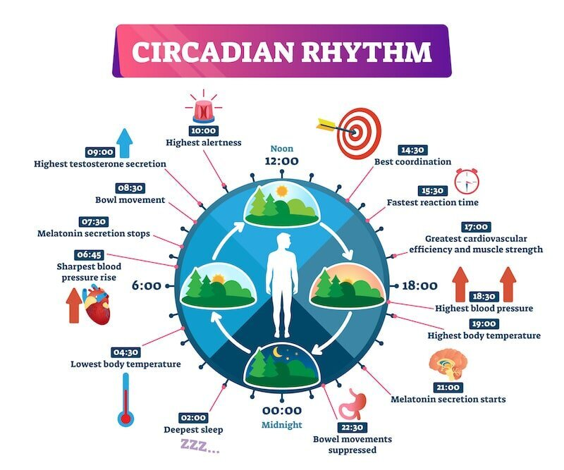
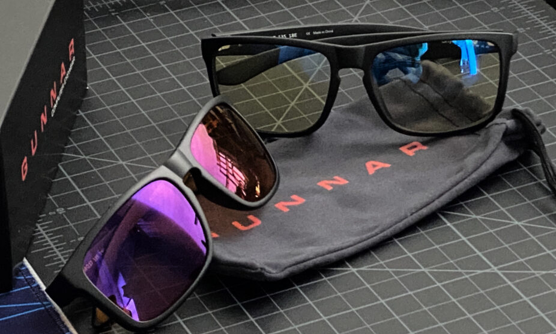

Work days for me are usually all over the place. Some days I’ll be out on a production for 10 to 12 hours, and other days I’ll be in front of a computer screen (or in my case, three screens) for 10 to 12 hours. Mix that with a few hours of gaming per week and I quickly realized I needed a solution to make sure I don’t go blind by the age of 35. 

After a long week inside of [Unreal Engine](https://www.unrealengine.com/en-US) a few years ago, my eyes were feeling the fatigue. This is how my search for blue light glasses came to fruition. 

At first, I did no research. I just bought a [cheap pair from Amazon](https://geni.us/blue-glasses) and thought that would fix all of my issues. It didn’t, they were just two plastic lenses that went over my eyes. So I started to investigate further and actually look into what blue light from screens can do to not only your eyesight, but quality of sleep and circadian rhythm.

## Our Body is a Clock

The circadian rhythm is our body’s internal clock that regulates sleep-wake cycles. It relies on external cues, especially light and darkness, to function correctly.

The production of melatonin is influenced by the circadian rhythm, which is, in turn, affected by light exposure. During the day, blue light from the sun suppresses melatonin production, keeping us alert. As the sun sets and darkness sets in, melatonin production increases, signaling the body that it’s time to sleep.

Devices like smartphones, tablets, and computers emit substantial amounts of blue light. When used extensively, especially during the evening or before bedtime, they can actually trick the brain into thinking it’s still daytime. 

[Some studies suggest](https://www.ncbi.nlm.nih.gov/pmc/articles/PMC6288536/) that prolonged sessions looking at blue light can increase the risk of macular degeneration, a condition that affects the center of your visual field.

While blue light is a natural and essential part of our environment, the excessive and untimely exposure from screens can have implications on our sleep and overall health.

## Gunnar Optiks Saved My Optics

After reading dozens of reviews and performing my due diligence into the cause of eye fatigue, I went with a pair of [Gunnar Optiks](https://geni.us/optiks) and these things have been a game changer. I have a pair that I keep at work and a pair that I use at home.

As a kid, I always wanted Gunnars because they sponsored all of the huge gaming tournaments that I watched. The price point is about on par for the market, which in itself is way overpriced, but they really have been worth every penny.

You can actually feel the difference when you have them on as they turn everything into a warm hue that is pleasant on the eyes. 

It’s worth noting that the non-prescription glasses have very slight magnification on the lenses. It’s not all that great for people, that really don’t need any magnification. It took me a couple weeks to adapt to that since I don’t wear prescription glasses.

There are models with titanium frames and for what is worth, they are really good frames. The two pairs I have are plastic-framed and the quality is nice but I would never wear these as a fashion accessory.

Another huge difference-maker and a very quick tip for those who spend tons of time in front of a screen, use the [Dark Reader plugin for Google Chrom](https://chrome.google.com/webstore/detail/dark-reader/eimadpbcbfnmbkopoojfekhnkhdbieeh)e, it breaks some websites but it turns bright colors into more pleasing and relaxing darker colors. 

## If You’re Reading This, It’s Not Too Late

As we embrace the conveniences of the digital world, it’s essential to remember the age-old saying: moderation is key.

While screens connect, inform, and entertain us — it’s up to us to set boundaries. By limiting screen time and adopting tools like blue light glasses, we ensure that our health isn’t the price we pay for progress.

To close things out, I’ll leave you with a piece of healthy advice: make sure you are [taking time away from screens to decompress](https://clockwork9.com/blog/creative/unplug-recharge-an-antidote-to-burnout/) and give your eyes a break. After all, there’s enough grass in the world for everyone to touch once in a while!
