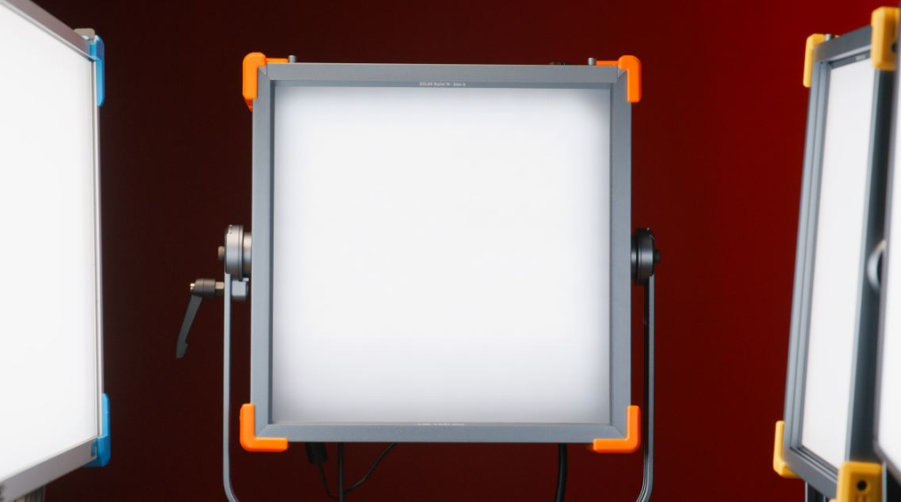
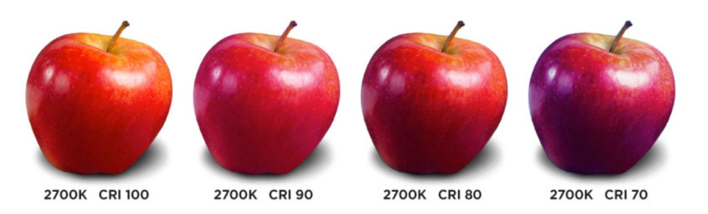
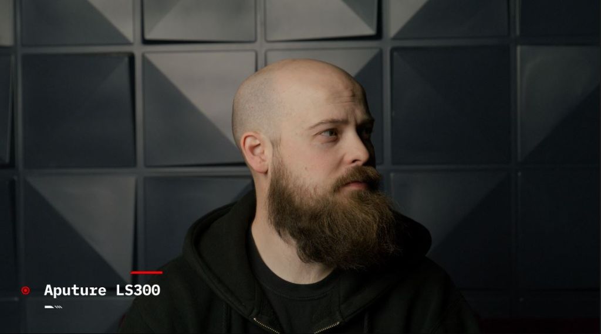
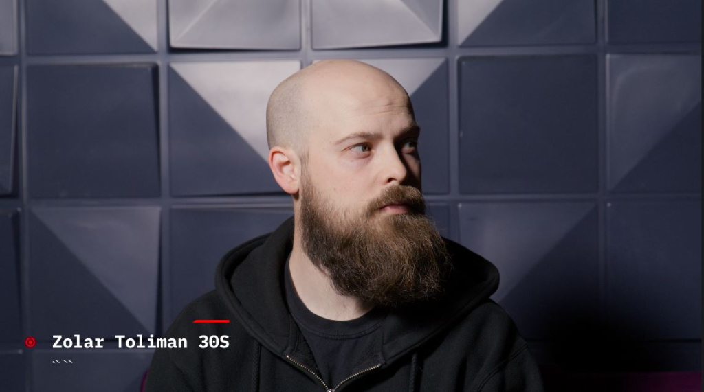
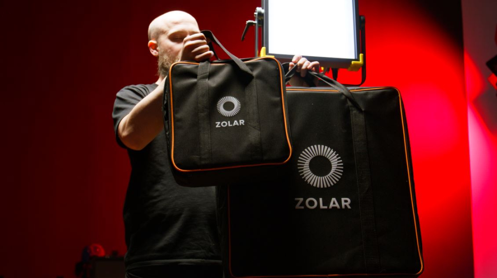

<iframe width="560" height="315" src="https://www.youtube.com/embed/TkdT9XC75cU" title="Cheap Lighting for Video Production | Zolar Toliman 30S Review" loading="lazy" frameborder="0" allow="accelerometer; autoplay; clipboard-write; encrypted-media; gyroscope; picture-in-picture; web-share" allowfullscreen=""></iframe>

## Zolar: A Trade-off or the Real Deal?

This is the [Zolar Toliman 30S Bi-Color LED Light Panel](http://www.z-cam.com/zolar/toliman-30s/). At just under $500, it’s a super affordable professional light that has color accuracy scores higher than lights from [Arri](https://www.arri.com/en) and [Aputure](https://www.aputure.com/).

This interesting light also has some features I have not seen offered by other lighting companies. Some I love, some not so much. Let’s get into it.

## Zollywood?

The Zolar Toliman 30S is the lowest tier light offered by the new lighting company [Zolar](http://www.z-cam.com/zolar/). Zolar is a subsidiary of [Z Cam](http://www.z-cam.com/). Z Cam is an interesting cinema camera company who has just started to break into the mainstream cinematography industry. Their big claim to fame is the most recent [Mission Impossible 7](https://www.youtube.com/watch?v=2m1drlOZSDw), in which Tom Cruise and DOP Fraser Taggart personally approved the [E2-F6 version](http://www.z-cam.com/e2-f6/) for most of the action sequence filming.

<iframe width="560" height="315" src="https://www.youtube.com/embed/-lsFs2615gw" title="Mission: Impossible - Dead Reckoning | The Biggest Stunt in Cinema History (Tom Cruise)" loading="lazy" frameborder="0" allow="accelerometer; autoplay; clipboard-write; encrypted-media; gyroscope; picture-in-picture; web-share" allowfullscreen=""></iframe>

## Affordable and High Fidelity Production Lights

Zolar currently has 3 light offerings. The Toliman 30S is the lowest tier, next is the [Toliman 30C](http://www.z-cam.com/zolar/zolar-toliman-30c-professional-led-lighting-z-cam/) which has an increase in intensity and separate ballast. [Last is the Vega](http://www.z-cam.com/zolar/zolar-vega-30c-professional-led-lighting-z-cam/) which has a full RGB RAW color gamut. All three offer bluetooth, WiFi and remote connection in addition to a control panel on the back of the light. [Zolar also boasts an app](https://apps.apple.com/al/app/zolar/id1617385822) that can connect up to 50 Zolar lights via bluetooth for direct control. 

With Zolar’s first iteration, they have chosen to stand out with one of highest Color Accuracy scores for a light on the market; With a [Color Rendering Index (CRI)](https://www.westinghouselighting.com/lighting-education/color-rendering-index-cri.aspx#:~:text=A%20CRI%20of%20100%20shows,better%20the%20color%20rendering%20capacity.) of 98 out of 100. CRI measures how accurate artificial light shows colors of the objects being lit by them. A 98 is impressive because our [Aputure Nova](https://www.aputure.com/products/nova-p300c/) and [Arri Skypanel](https://www.arri.com/en/lighting/led/skypanel) lights are only rated with a 95 CRI score, for comparison.

An all aluminum structure with some ABS corner bumpers makes for a solid build. It definitely feels strong and I’d hope so with a soft case that probably can’t take as many drops or hits as the light itself. If you pack light for your shoots or aren’t traveling with lights as much, the soft case is a great choice. In a grip truck, however, I wouldn’t trust it around metal stands and Pelican cases. 

## Skin-Tone Accuracy and Effectiveness in Smaller Spaces

After running some quick tests comparing the 30S to a “lower tier” production light, the [Aputure Lightstorm 300x](https://www.aputure.com/products/ls-300x/), we found that we get a green tint at 5600K on the Lightstorm, so I did a quick test on how my skin tone appears under both the Aputure Light Storm and Zolar Toliman 30S. The 30S was much more accurate in both hue and luminance. This is thanks to its 25o optical design lens array and Zolars “Self Adaptive Spectral Nonlinear Dynamic Illuminance Calibration System”.

 

We found that the fans hardly run, and if they do, they’re almost silent. There are modes to change the functions of the fans as well. But with this size light I don’t think I’d mess with it.

The Toliman also boasts all the lighting effects you’d expect from a panel light, like candle flicker and paparazzi, among other modes.

## The Toliman 30S isn’t Perfect

I have a few critiques for the Zolar lights. I would prefer a hard case that will survive a fall and toppling in the grip truck. On all other Zolar models, there is a separate ballast that also only fits in its own separate bag like the lights with foam padding. I’d like to have everything together in one. 

The Toliman 30S is great for small spaces but with our current kit I’d need something with more intensity than this small light. 

Lastly, the Zolar accessories are all the basic necessities in my opinion. As of now, Zolar has come out with [barndoors, grids, softboxes, and one additional stylist insert](http://www.z-cam.com/zolar/zolar-accessories/) that all fit in the existing 3 channel slots. Not sure if anything else is needed, but  an intensifier and gels would be fun.

## “The Sun is the Limit”

Super high performance at an incredibly affordable price are the biggest advantages the Zolar Toliman 30S is hitting me with. If you had your eye on, let’s say, an [Aputure Nova P300c](https://www.aputure.com/products/nova-p300c/), those go for around $1,700 USD new. 

For $1,000 USD, you can achieve relatively the same Lux (9000Lux) with two Tolimans as a key, and you can have a two light setup as well. AND! That still leaves you $700 USD for other equipment. 

I would recommend these lights to those building a home studio or streaming space, and those looking for their first set of professional lights. 

I will be keeping my eye on Zolar lights. I think they’ll be releasing a larger light that you are more likely to see showing up on set and ready to compete with the likes of Arri and Aputure.
