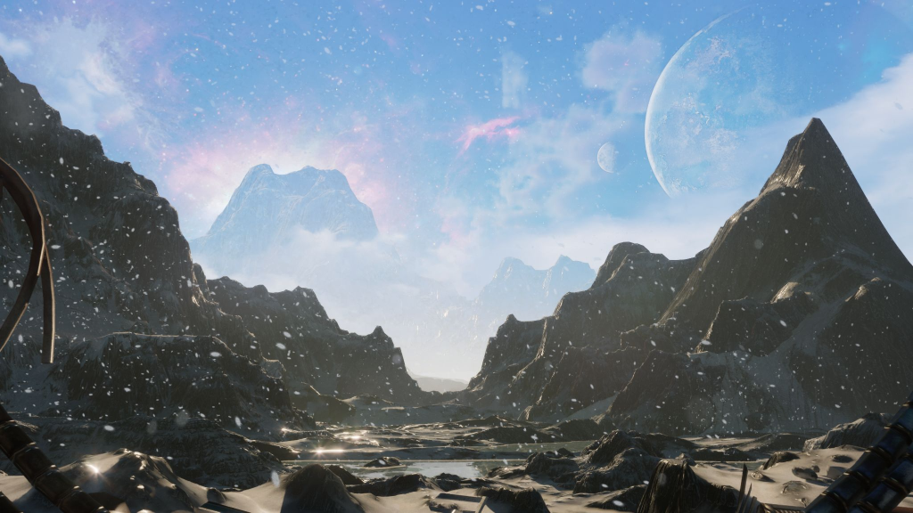

<iframe width="560" height="315" src="https://www.youtube.com/embed/5S4-ylLYNp8" title="Unreal Engine 5 is AMAZING" loading="lazy" frameborder="0" allow="accelerometer; autoplay; clipboard-write; encrypted-media; gyroscope; picture-in-picture; web-share" allowfullscreen=""></iframe>

Back in 2021, we had a client project that required building a scene in virtual reality using [Unreal Engine 4](https://www.unrealengine.com/en-US/). 

Knowing absolutely nothing about game development or architectural visualization, it was an extremely tall task for me. Little did I know it would spark a new curiosity and open up a new avenue of visual tools that not many cinematographers can fully grasp. 

By the end of the project, I had built out a scene that showcased the company’s product and packaged it for use in VR toolkits. The opportunity to dive into something that was just breaking into the film world was exciting and fulfilling as ever. 

One of my main goals in life when deciding to take the creative path was to diversify and try things that very few people around me have tried. This is an opportunity to show the potential and practicality of Unreal Engine for filmmakers across the world. 

## If You’ve Been Under a Rock for the Past Decade

For those who are unfamiliar, Unreal Engine is a game engine and development toolset created by [Epic Games](https://store.epicgames.com/en-US/). 

It is primarily used to develop video games, but can also be used to create other types of interactive content, such as architectural visualizations, training simulations, and virtual reality experiences. 

Additionally, Unreal Engine has a [large and active community of users](https://www.unrealengine.com/marketplace/en-US/store) who share assets, tutorials, and other resources to help others get the most out of the engine. 

Every month there are new assets that are free in the marketplace, and by using external resources such as [Quixel Bridge](https://quixel.com/bridge) and [Sketchfab](https://sketchfab.com/), you don’t need to spend a dime to get started in creating virtual worlds. 

For this particular scene, I used a [free Planetary Base map](https://www.unrealengine.com/marketplace/en-US/product/polar-sci-fi-facility) provided in the Unreal Marketplace.

In conjunction with the free [Metahuman Creator toolkit](https://metahuman.unrealengine.com/), which was used to create a character and animate his face with motion capture technology, I don’t even have to show my face on camera anymore. [Live Link Face](https://docs.unrealengine.com/4.27/en-US/AnimatingObjects/SkeletalMeshAnimation/FacialRecordingiPhone/) is a free iPhone app that connects directly to Unreal, facial mocap has never been easier (and cheaper too)!

## A Game Developer in a Filmmaker’s Body?

I’m one of those people who always played a game for the realism aspect and overall weight that my in-game decisions had on the overarching story. My favorite games of all time, Fallout 3 and Fallout: New Vegas did this beautifully. 

I never understood why I enjoyed the storytelling aspects of games so much over battle pass content or DLC that seem to be the main focus of many studios nowadays. Later, I came to learn that this is because I’m inherently a visual artist. 

Unreal Engine offers filmmakers the ability to visualize how light interacts with people and objects in specific environments, making it an excellent tool for virtual scene visualization. 

The in-engine sequencer allows for animation of any object in the scene, including cameras, which is perfect for creating product videos and conceptualizing experiences and installations. This approach enables accurate representations of the project’s direction and scope, essentially allowing you to storyboard within a 3D space. 

Combined with non-linear editing software, this tool can deliver hyper-realistic sequences without using a physical camera. Moreover, the software is entirely free, and the vast marketplace has many assets that you can incorporate into your world to achieve the desired effect. 

So what makes Unreal Engine such a powerful tool that continues to expand at a rapid pace? Well, there are a few reasons.

## The Game Engine to End All Game Engines

### Accessibility is Everything

Unreal provides a comprehensive set of features to create high-quality games without starting from scratch. With its intuitive interface, developers can quickly and easily design and create complex game mechanics, physics simulations, and stunning graphics that are compatible with multiple platforms, including PCs, consoles, mobile devices, and virtual reality.

One of the engine’s unique features is its ability to support cross-platform development. This means that developers can create a game that can be played on multiple devices, saving time and money in the development process. 

Epic, the developers behind Unreal, have also created [Fortnite’s Creative 2.0 mode](https://dev.epicgames.com/community/fortnite/getting-started/creative), which enables players to create their maps using the engine’s programming tools and language. This new mode is set to introduce Unreal to a new audience of gamers.

### The Transformation and Innovation of the Film Industry

The engine’s innovation is another reason for its success. Its modular architecture enables developers to customize and extend its capabilities to meet their specific needs. 

The film industry has also embraced Unreal technology, with The Mandalorian using virtual walls and landscapes to create scenes behind the set. This has opened up new possibilities for filmmakers, enabling them to create stunning visual effects and realistic backdrops in real-time with virtual production.

With continuous improvements, each version of Unreal offers something new to users. For example, the [Lumen global illumination feature](https://docs.unrealengine.com/5.0/en-US/lumen-global-illumination-and-reflections-in-unreal-engine/) enables developers to create realistic lighting effects that adjust in real-time, making the game more immersive. Similarly, [the new geometry system, Nanite](https://docs.unrealengine.com/5.0/en-US/nanite-virtualized-geometry-in-unreal-engine/), enables developers to create highly detailed environments without sacrificing performance.

The engine’s computing power has significantly improved with the advancement in hardware technology. This blurs the line between virtual and real worlds, resulting in the purest and most stunning entertainment. The dynamic lighting and real-time raytracing produce incredibly realistic visuals, as seen in the Metahuman Creator update that simplifies and improves facial capture.

## It’s Just the Beginning for Virtual Production.

Unreal’s capabilities and versatility make it a crucial technology for various industries, including gaming, film, architecture, and more. As the engine becomes smarter and more efficient, developers and hobbyists will be able to create scenes more quickly and easily.  The film industry will continue to adopt these techniques as virtual production becomes more robust.

Overall, Unreal is an extremely powerful tool that has revolutionized the gaming and film industries and will continue to do so with its continuous improvements and innovations.
