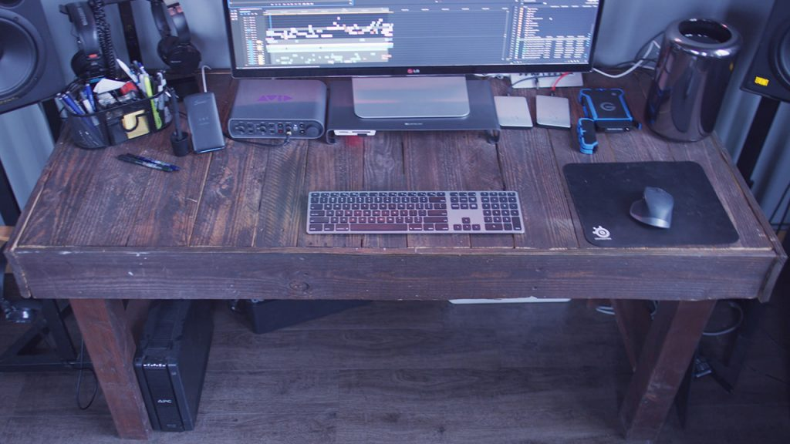
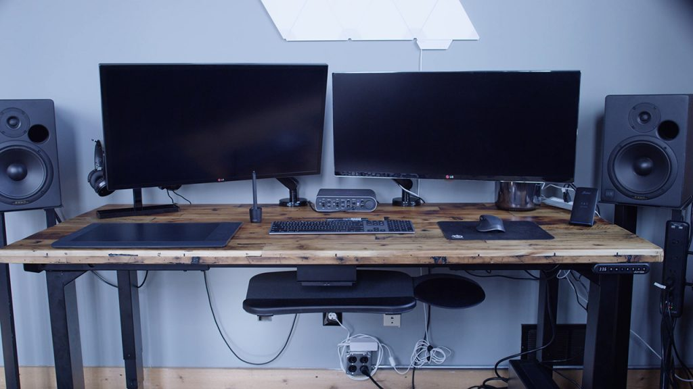

<iframe width="560" height="315" src="https://www.youtube.com/embed/lx0AlIRkpp0" title="The Best Adjustable Standing Desk We Could Find Online - Our Review of the UPLIFT Desk" loading="lazy" frameborder="0" allow="accelerometer; autoplay; clipboard-write; encrypted-media; gyroscope; picture-in-picture; web-share" allowfullscreen=""></iframe>

### We are smitten and you will be too

You can’t predict when the right desk is going to come into your life… but when it does… you know what they say… when you know, you know.

## **Chapter 1: The Breakup**

When we started C9 back in 2016, we didn’t have two nickels to rub together. So finding a functional and affordable desk was hard to come by. After perusing craigslist for a while, I eventually found a guy who was willing to assemble some pallet desks together for $50 each.

All things considered it was a pretty reliable desk for the price. We carried on in a loving relationship for about 3 years. But once we got out of the honeymoon stage and the splinters came along.. It wasn’t long before we realized we weren’t serving each other anymore. It was hard, but eventually we decided it was time to move on. My mom had been telling me for years that I deserved better.. But I guess I had to figure that out on my own.

## **Chapter 2: Online Dating**

I was a little nervous to jump back into the online match-making scene, but I knew it was time.

As I began this quest for my new soul…desk, I knew it needed to have a few key characteristics:

*   Height adjustable
*   Smooth, even surface
*   Large surface area to work on
*   4 legged
*   Affordable

Initially, I had swiped left on Uplift because it didn’t fit my criteria of being affordable. But the more research I did, the more I realized I would only be able to find my near-perfect match if I gave a little on my budget. To me, it was more important to have a desk that functioned the way I needed than it was to save a few hundred dollars.

So I gave Uplift a chance and wow.

I have never had a better relationship with my desk than I do now. 

It took a little bit of time to put together but I feel that’s how every great relationship begins – you have to put in the work. It’s a quiet desk. It’s a smooth-moving desk. The buttons are simple and easy to use. Overall, I love my new desk and I feel like this might be a forever type deal. 

Is it a surface-level relationship? Some might say so. But my mom approves… so that helps.

[Get your new Uplift desk today!](https://www.upliftdesk.com/uplift-v2-4-leg-standing-desk/)

## Looking for a Standing Desk for Less?

[Check out the standing electric desk from Brodan](https://clockwork9.com/2021/02/16/is-this-the-best-standing-desk-on-amazon-for-under-500-our-review-of-the-brodan-electric-desk/). While not as fancy as the UpLift desk, it’s a fraction of the cost and provides tremendous value. We picked up a couple of these bad boys and couldn’t be happier.
