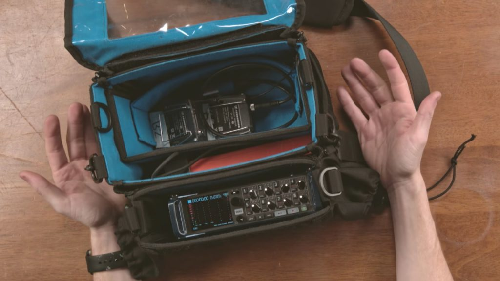
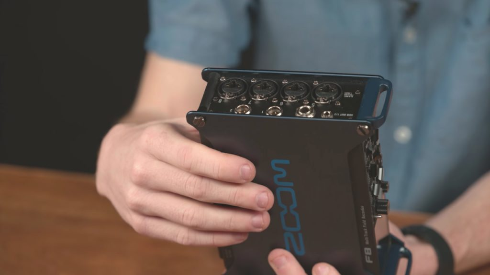
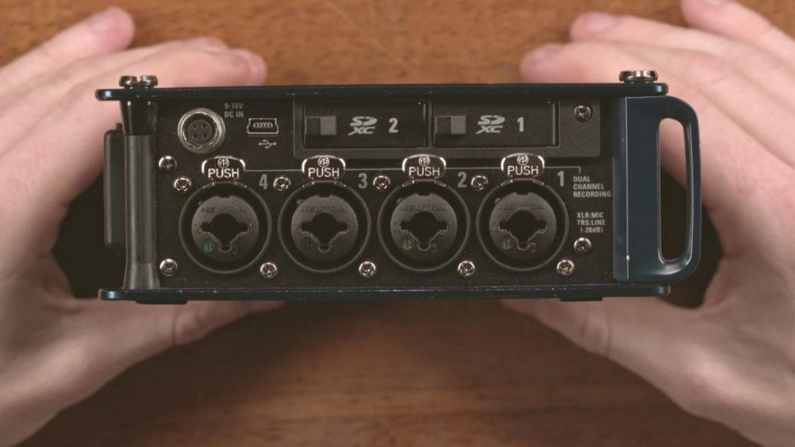
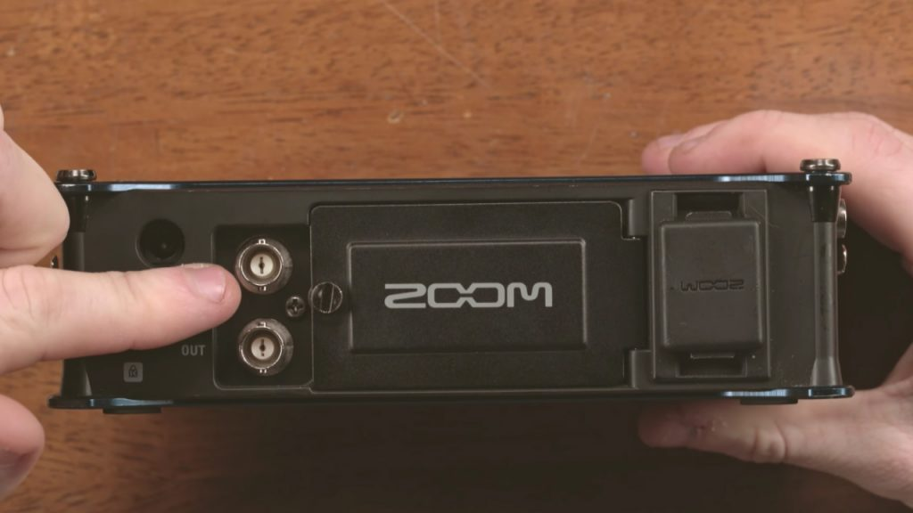
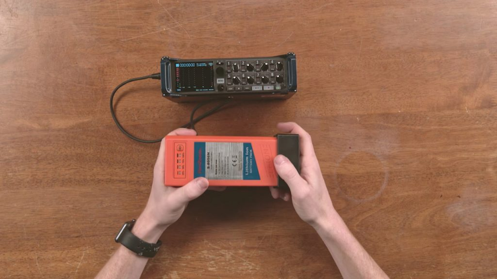
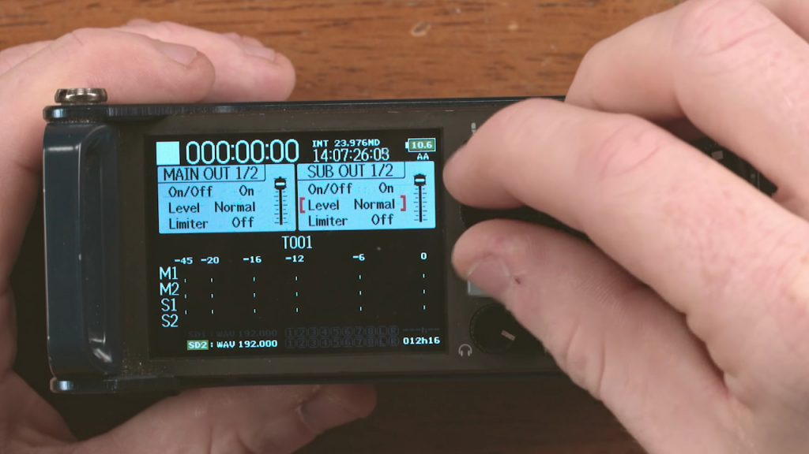

<iframe width="560" height="315" src="https://www.youtube.com/embed/yGearMzfk2E" title="Zoom F8 MultiTrack Field Recorder — Review" loading="lazy" frameborder="0" allow="accelerometer; autoplay; clipboard-write; encrypted-media; gyroscope; picture-in-picture; web-share" allowfullscreen=""></iframe>

For the last few years we’ve been using the Zoom F8 audio recorder for literally everything. Any type of shoot that we’ve come across: documentary, live event, you name it… this thing works great.

Before diving into all the specs of this workhorse, we want to share some of our favorite aspects. First and foremost…

## **The Travel Case**

This case is essential for this audio recording experience. The F8 fits nice and snug in the first slot. The slot behind it is perfect for the Brick to fit in easily. And the space behind that is pretty big. There you can fit plenty of lavaliers, batteries, XLR cables, or tentacle syncs. 

The side pockets are a huge asset on set as well because it serves as a waterproof tunnel for your cables to run directly into their XLR ports on the F8.

The side zippers are also a great feature, one we haven’t seen in a case before. This allows us to run our power form the Brick to the HiRose port without any wires sticking out or cluttering our workspace on the interface.

On the outside we have an external pack for additional storage. We usually keep extra double A batteries in there just in case anything happens with our Brick power.

Lastly, on the front flap there is a slot for you to slide an iPad in. Why would you want to put an iPad in there? Because you can actually operate the entire Zoom F8 from an iPad using its app. This means our audio setup is completely waterproof. 

## **Expandability**

The Zoom F8 has 8 XLR inputs (all phantom power optional) and 2 mini XLR ports. This gives you the ability to run around with a bunch of lavaliers, a couple shotguns, and external recorders no problem. 

The mini XLR ports are convenient because it allows you to have a director monitoring the audio on set.

It also has an external mic that allows you to reference the scene or the interview whatever location you’re shooting in, which has really helped us in post-production.

On the back of the F8 we have the universal Zoom mount. The adapter we have is a 180 degree recording microphone which we use for ambiance and environmental audio pickup. It also has an extension cable that runs about 10 feet if you didn’t want that adapter to be locked into the interface.

## **Memory**

This interface records dual SD which is a huge safety net for us on set. It serves as a backup which is great, period. But secondly, if you want to ensure that your audio is solid, you can record in a lower decibel on the second card in case the first card peaks. 

Our recommendation for SD cards is always go high speed and shoot for cards around 95 mb.

## **Sync In and Out Ports**

Considering the price point of this audio recorder, having these two ports is a major advantage. Anything else with this ability would cost somewhere in the couple thousands. This is a huge selling point for us because it allows us to generate timecode. We shoot mainly on DSLR and RED cameras which don’t generate timecode making syncing audio and video in post much more challenging.

With the F8 having this port, we are able to cut down post-production video-audio syncing down substantially. How? We use a device called Tentacle Sync which plugs directly into those Sync ports which generates the timecode directly into the device. Then we plug that Tentacle Sync directly into our DSLR or RED and wallah.

## **HiRose Input**

This is a Godsend. This input allows us to use MP style batteries for power. The battery we have is about a pound. We call it “The Brick” and the name fits. This battery is good for about 12-14 hours of recording which is HUGE for our post-production team.

Post-production?

Yes, post-production. Every time you unplug or turn off the F8 to save power… you disrupt the sync and your timecode. This makes for an awful editing experience trying to resync the audio and video. 

The Brick fixes all of that with its long-lasting charge. You can leave your F8 running for the entire shoot without having to disconnect to save battery life. Not having to disconnect means the timecode and sync stays intact.

## **Frontface Menu**

Here you have the option to work between your levels, limiters, subs, and mains. It also gives you individual channel options as well as multi-channel options: 1-8 and L R. 

Want to turn on Phantom? It’s as easy as turning on PFL on your channel or going into the Phantom options and turning it on. You could also go to input, scroll to Phantom, and click on or off.

We also appreciate the system menu. We use this for setting up shortcuts that you can use while you’re recording in case you hadn’t established your settings prior to recording.

## **Disadvantages**

Small control knobs and Double A power. Other than that, this piece of equipment has been essential for us and we highly recommend it.

## **Specs**

| Category | Spec |
| --- | --- |
| Inputs | 8 XLR2 mini XLRUSB interface for studio needs |
| Max Bit Rate | 24-bit 192KHz audio |
| Memory | Dual SD slot |
| Menu | LED screen (iPad connectivity) |
| Power | Double A Batteries; Power DC; NP Style Battery to HiRose Input |
| Mounts | Camera Mount; Zoom Mic mount on bottom for variety of attachments |
| Misc. | External Mic and Tone switch; Headphone Knob; TimeCode and tentacle syncs directly out from F8 |

If you’re looking to purchase a multi-channel recording device in the near future, this is a good guide to one of the better, more affordable options on the market. 

[Get the Zoom F8](https://amzn.to/2IdR98q)  
[Get the Waterproof Protective Case](https://amzn.to/2Gh1O5P)  
[Get the Tentacle Sync](https://amzn.to/2us5Cvo)
